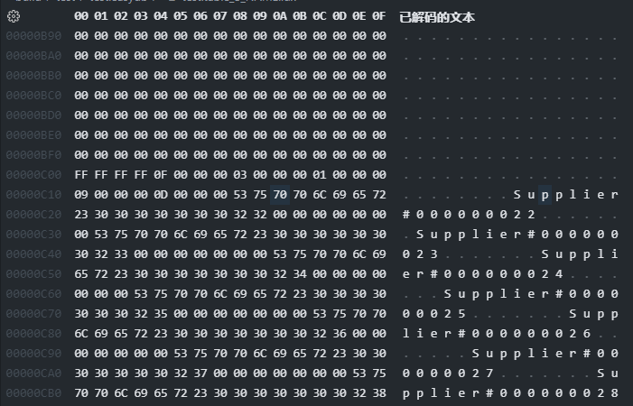
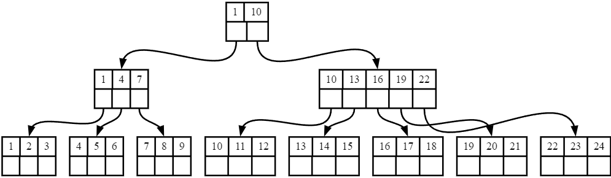
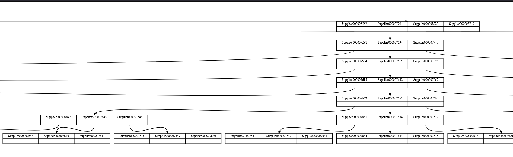

<h1 style="display: flex; justify-content: center">索引管理实验报告</h1>

# 1. 实验分工安排

周强俊：B+树索引、报告撰写

唐雨馨：可扩展哈希、报告撰写

周智淦：可扩展哈希、报告撰写

字阳：测试、索引可视化、报告撰写

# 2.系统环境

系统：Ubuntu-24.04

clang版本：18.1.3

glibc版本：2.39

cmake版本：3.28.3

# 3. 实验设计与实现

## 3.1 B+树索引

### 3.1.1 概述

在数据库系统中，索引为提高查询性能和数据完整性的重要功能。该系统支持唯一索引，允许用户为表中的字段创建索引以保证字段值的唯一性，同时实现了索引的增删改查功能。索引模块通过 **B+树** 数据结构实现，支持单点查询和范围查询，确保索引与基表数据的同步。

### 3.1.2 B+树索引的设计

系统中使用 B+ 树作为索引的底层结构。B+ 树的每个节点存储在磁盘文件的一个页面中，节点中包含若干键值对，形式为 `<key, value>`。其中 `key` 为索引字段的值，`value` 为该记录在表中的唯一标识符（RID）。索引数据被持久化到磁盘文件中，并能通过以下模块实现对索引的增删改查：

- **IxManager 类**：为系统上层提供创建索引、删除索引、读取索引文件、关闭索引文件等功能。
- **IxNodeHandle 类**：负责对 B+ 树节点的具体操作。
- **IxIndexHandle 类**：提供对整个 B+ 树的操作接口。
- **IxScan 类**：用于遍历 B+ 树的叶子节点，支持范围查询和全表扫描。

### 3.1.3 B+树索引的元数据结构

系统通过 `IxFileHdr` 管理 B+ 树文件的元数据，在节点页面中通过 `IxPageHdr` 管理页面的元信息。页面头部存储页面元数据，后续存储键 `key` 列表，页面尾部存储值 `value` 列表。通过 `keys_size_` 字段记录键的大小，以便快速定位值的起始位置。`first_leaf` 和 `last_leaf` 字段记录首尾叶节点页面号，有助于叶节点的顺序遍历。

- **IxFileHdr 类**：该类用于管理 B+ 树文件的元数据，记录了 B+ 树的结构和基本配置信息。其主要字段和作用如下：
  
  - `first_free_page_no_`：文件中第一个空闲的磁盘页面的页面号。
  - `num_pages_`：磁盘文件中的总页面数。
  - `root_page_`：B+ 树根节点的页面号。
  - `col_num_`：索引涉及的字段数量。
  - `col_types_` 和 `col_lens_`：索引字段的类型和长度。
  - `col_tot_len_`：索引字段的总长度。
  - `btree_order_`：每个节点最多可插入的键值对数量。
  - `keys_size_`：记录当前节点中所有 `key` 数据的大小，用于确定 `value` 的起始地址。
  - `first_leaf_` 和 `last_leaf_`：分别存储 B+ 树的首叶节点和尾叶节点的页面号。
  - `tot_len_`：记录 `IxFileHdr` 结构的整体长度。

- **IxPageHdr 类**：用于管理 B+ 树节点页面的元数据，其主要字段和作用如下：
  
  - `parent`：父节点的页面号，用于节点间的层级关系。
  - `num_key`：已插入的键数量，范围为 `[0, num_key)`。
  - `is_leaf`：标记是否为叶节点，叶节点存储实际数据的键值对。
  - `prev_leaf` 和 `next_leaf`：分别为前一个和后一个叶节点的页面号，仅对叶节点有效。

### 3.1.4 B+树索引的操作接口

- **创建索引**：调用 `IxManager` 类中的创建接口，在目标表上建立唯一索引，创建相应的 B+ 树结构。
- **删除索引**：`IxManager` 提供删除接口，清理索引文件中的节点和元数据。
- **插入与删除**：调用 `IxIndexHandle` 类中的 `InsertEntry` 函数，将 `<key, value>` 对插入到 B+ 树中来更新索引。删除则调用 `DeleteEntry` 函数，在对应节点中找到 `key` 并将其删除，确保索引结构完整。
- **单点查询**：调用 `IxIndexHandle` 类中的 `GetValue` 函数，根据索引 `key` 查找到相应的记录标识符 `rid`，直接定位到表中的记录。
- **范围查询**：`IxScan` 类遍历 B+ 树的叶节点，执行基于范围的查询操作，以支持从指定 `key` 范围内快速查找匹配的记录。

### 3.1.5 索引节点管理

B+ 树的每个节点以页面的形式存储在磁盘文件中。根据节点是否为叶节点，页面中存储的内容有所不同：

- **叶节点**：存储实际数据的键值对，形成 B+ 树的底层结构。
- **非叶节点**：存储用于索引导航的键值，链接不同节点，为查询提供指引。

系统通过 `IxNodeHandle` 类对节点的内容和元数据进行管理，包括键值的插入和删除、节点分裂与合并等操作。

## 3.2 可扩展哈希索引

本实验实现了一个可扩展哈希索引结构，该索引能够动态调整目录深度并分裂目录和桶来扩展哈希表结构以适应数据量的增长，同时提高哈希冲突的处理能力，确保高效的数据插入、删除和查询操作。

### 3.2.1 实现思路

实现可扩展哈希索引的关键步骤：

1. **初始化文件元信息**：创建`ExtendibleHashIxFileHdr`和`IxExtendibleHashIndexHandle`实例，初始化文件的基本信息，如页数、目录页面等，哈希索引初始化深度为1，即两个桶。
2. **哈希目录结构管理**：在`IxExtendibleHashIndexHandle`中实现动态调整哈希目录深度的功能。当某个桶发生溢出时，判断目录是否需要扩展并触发目录分裂。
3. **桶分裂操作**：当桶满时，在`IxBucketHandle`中根据桶的局部深度判断是否可分裂，分裂成功后将一半数据迁移至新桶，同时更新哈希目录映射。
4. **增删改查接口实现**：在`IxExtendibleHashIndexHandle`中实现插入、删除、查找操作。查找根据键的哈希值计算路径，定位至对应的桶，再由`IxBucketHandle`执行具体的增删改操作。

### 3.2.2 代码实现

可扩展哈希实现的核心包括四个关键类：`ExtendibleHashIxFileHdr`、`IxExtendibleHashIndexHandle`、`IxBucketHandle`和`IxExtendibleHashPageHdr`。

```c++
class ExtendibleHashIxFileHdr {
  page_id_t first_free_page_no_;    // 文件中第一个空闲的磁盘页面的页面号
  int num_pages_;                   // 磁盘文件中页面的数量
  page_id_t directory_page_;        // hash目录对应的页面号
  int col_num_;                     // 索引包含的字段数量
  std::vector<ColType> col_types_;  // 字段的类型
  std::vector<int> col_lens_;       // 字段的长度
  int col_tot_len_;                 // 索引包含的字段的总长度
  int keys_size_;                   // keys_size = (BUCKET_SIZE + 1) * col_tot_len
  int tot_len_;                     // 记录结构体的整体长度(IxFileHdr的size)
}

class IxExtendibleHashIndexHandle {
  DiskManager *disk_manager_;
  BufferPoolManager *buffer_pool_manager_;
  int fd_;                             // 存储可扩展hash的文件
  ExtendibleHashIxFileHdr *file_hdr_;  // 存储hash表元信息
  std::mutex root_latch_;
  int global_depth;     // Record the global depth of the hash table
  bool GetValue(const char *key, std::vector<RID> *result); // for search
  page_id_t InsertEntry(const char *key, const Rid &value); // for insert
  bool DeleteEntry(const char *key);  // for delete
}

class IxBucketHandle {
  const ExtendibleHashIxFileHdr *file_hdr;  // 节点所在文件的头部信息
  Page *page;                               // 存储桶的页面
  IxExtendibleHashPageHdr *page_hdr;  // page->data的第一部分，指针指向首地址
  char *keys;  // page->data的第二部分，指针指向首地址
  Rid *rids;   // page->data的第三部分，指针指向首地址
}

class IxExtendibleHashPageHdr {
  int local_depth;  // Depth of the current bucket
  int key_nums;     // Number of keys in the current bucket
  int size;         // Size of the bucket
};
```

#### 3.2.2.1 ExtendibleHashIxFileHdr

`ExtendibleHashIxFileHdr`类用于存储整个哈希文件的元信息。一个可扩展哈希表在磁盘上持久化为一个文件，该类作为文件的header，包含以下主要字段：

- **文件管理字段**：
  - `first_free_page_no_`：存储文件中第一个空闲磁盘页面的页面号，以便为新桶分配空间。
  - `num_pages_`：记录文件中总页面数量。
- **目录管理字段**：
  - `directory_page_`：存储哈希目录的页面号，该页面维护了哈希索引的目录结构。
- **索引结构字段**：
  - `col_num_`、`col_types_`、`col_lens_`：用于描述索引字段的数目、类型和长度信息，确保能够处理不同字段类型的数据。
  - `col_tot_len_`：索引字段的总长度，用于计算每条记录的存储大小。
  - `keys_size_`：由 `(BUCKET_SIZE + 1) * col_tot_len` 计算得出，表示单个桶所需存储空间。

#### 3.2.2.2 IxExtendibleHashIndexHandle

`IxExtendibleHashIndexHandle`是可扩展哈希的核心管理类，负责管理哈希表的目录、全局深度、文件元信息、缓冲区管理器等重要结构。其主要功能包括：

- **元数据维护**：
  - `disk_manager_` 和 `buffer_pool_manager_`：用于管理磁盘和内存的缓冲区池。
  - `fd_`：存储哈希表文件的文件描述符，以便对文件执行读写操作。
  - `file_hdr_`：指向`ExtendibleHashIxFileHdr`对象，便于读取或更新文件的元信息。
- **核心操作接口**：
  - `GetValue(const char *key, std::vector<RID> *result)`：实现键值的查找操作，支持通过哈希索引查找特定键的值。
  - `InsertEntry(const char *key, const Rid &value)`：实现键值对插入操作。若桶已满，将触发桶分裂操作，并可能更新目录结构。
  - `DeleteEntry(const char *key)`：实现键值对删除操作，通过目录和桶的深度管理，确保空间得到释放。
- **目录与桶管理**：
  - `global_depth`：记录哈希表的全局深度。每次当目录发生扩展时，全局深度会相应增加。
  - `root_latch_`：用于线程同步，确保目录和桶操作的并发安全性。

#### 3.2.2.3 IxBucketHandle

`IxBucketHandle`类用于管理单个哈希桶，负责在内存中对桶的内容进行操作。一个哈希桶对应一个页面，可以使用缓冲区中的帧管理。当发生溢出时，通过指针链接多个帧存储溢出内容。关键字段包括：

- **页面管理字段**：
  - `file_hdr`：指向文件头信息，便于获取索引结构的元数据。
  - `page`：存储桶的页面信息，用于管理单个桶的物理存储位置。
- **页面解析与操作**：
  - `page_hdr`：表示桶页面的头部信息，包含该桶的元数据，如local depth和实际存储的键数。
  - `keys` 和 `rids`：分别指向桶中的键和对应的元组位置。通过这些指针，用户可以对桶中的键值对进行增删改查操作。

#### 3.2.2.4 IxExtendibleHashPageHdr

`IxExtendibleHashPageHdr`类用于描述单个桶的元信息，实现为桶对应页面的header，帮助管理桶的深度和空间分配。

- 元数据字段：
  - `local_depth`：表示桶的局部深度，控制桶的分裂条件。局部深度小于全局深度的桶可以通过增加局部深度来容纳更多的键值对。
  - `key_nums`：表示当前桶中的键数量。
  - `size`：表示桶的大小，用于监控桶的容量是否已满，以决定是否需要触发分裂操作。


# 4 使用手册

## 4.1 编译

```shell
# 先进入到项目目录
cd /path/to/easydb

# 新建build目录并进入
mkdir build
cd build

# 使用cmake编译项目
cmake ..
make -j
```

## 4.2 运行

```shell
# 进入到build/test/目录下
cd build/test

# 运行comprehensive_test并重定向stderr到文件
./comprehensive_test 2> comprehensive_test.log
```


# 5 测试方案与结果

## 5.1 测试设计与实现

### 5.1.1 读入supplier表格

该部分内容在实验1：存储管理实验中有详细描述，不多赘述。

### 5.1.2 新建B+树索引

首先要准备一下新建索引所需的元数据，这里我们对Supplier表格的S_NAME字段建立索引

```cpp
// 准备元数据
std::vector<ColMeta> index_cols;
index_cols.push_back(tb_reader.get_cols()[1]);
// 对S_NAME字段建立索引
std::string index_col_name = "S_NAME";
// 描述该字段的长度等信息
IndexMeta index_meta = {.tab_name = TEST_TB_NAME, .col_tot_len = 25, .col_num = 1, .cols = index_cols};
```

下一步我们初始化IxManager，用它来新建索引

```cpp
IxManager *ix_manager_ = new IxManager(dm, bpm);
ix_manager_->CreateIndex(path, index_cols);
```

到此为止，我们已经成功地建立了B+树的索引。但是我们还没有将表中原有的数据添加到索引中

### 5.1.3 添加表中数据到B+树索引

为了能够操作B+树索引，我们使用IxManager的方法OpenIndex，打开创建好的B+树索引，函数OpenIndex返回IxIndexHandle的指针。

```cpp
auto Ixh = ix_manager_->OpenIndex(path, index_cols);
```

为了能够遍历表中的所有记录，我们初始化RmScan来完成

```cpp
// fh_是之前打开的file_handler
RmScan scan(fh_);
```

然后我们使用while循环遍历表中的所有记录，对于每一个记录，我们取出其中的内容，找到我们要插入到索引中的字段，将对应的值复制到索引的key中，然后将key -> rid（record id）作为键值对插入到索引中
```cpp
// 遍历每一条记录
while (!scan.IsEnd()) {
  // 获取记录的id
  auto rid = scan.GetRid();
  // 获取记录内容
  auto rec = fh_->GetRecord(rid);
  char *key = new char[index_meta.col_tot_len];
  int offset = 0;
  // 将记录中我们要的字段的内容拷贝到key中
  for (int i = 0; i < index_meta.col_num; ++i) {
    memcpy(key + offset, rec->data + index_meta.cols[i].offset, index_meta.cols[i].len);
    offset += index_meta.cols[i].len;
  }
  // 将key -> rid的映射插入到索引中
  Ixh->InsertEntry(key, rid);
  delete[] key;
  // 获取下一条记录
  scan.Next();
}
```

### 5.1.4 B+树索引删除

索引删除的操作比较简单，只需要调用IxIndexHandler的DeleteEntry方法便可

```cpp
// Ixh是IxIndexHandler的实例，delete_key是要删除的key
Ixh->DeleteEntry(delete_key);
```

### 5.1.5 B+树索引修改

我们实现的B+树并没有直接提供一个修改Entry的API，但是我们可以通过先删除再插入的方式完成修改

```cpp
// 修改索引
Ixh->DeleteEntry(delete_key);
Ixh->InsertEntry(delete_key, new_rid);
```

### 5.1.6 B+树索引查找

B+树索引的查找需要通过类IxIndexHandler的GetValue方法实现查找功能

```cpp
// 索引查找
std::vector<RID> target_rid;
Ixh->GetValue(target_key, &target_rid);
```


### 5.1.7 B+树索引可视化

该步骤中，我们要遍历B+树索引，使用dot进行可视化。我们将整个可视化的过程包装成了一个类BPlusTreeDrawer

```cpp
BPlusTreeDrawer bpt_drawer("b_plus_index.dot", &(*Ixh));
bpt_drawer.print();
```

我们可以使用这个类将B+树转换成dot文件。具体来说，我们使用DFS的方式来遍历整个B+树

```cpp
void printNode(IxNodeHandle *_node) {
  if (_node == nullptr || _node->GetFileHdr() == nullptr || _node->GetPageHdr() == nullptr) return;
  // 先声明这个节点
  *outfile << getNodeDesc(_node) << std::endl;
  if (_node->IsLeafPage()) return;
  // 然后声明与子节点的关系
  for (int i = 0; i < _node->GetSize(); i++) {
    auto child = GetChild(_node, i);
    *outfile << getNodeName(_node) << " : " << "f" << i << " : s -> " << getNodeName(child) << " : n" << std::endl;
    printNode(child);
    bpm->UnpinPage(child->GetPageId(), false);
    delete child;
  }
}
```

这样我们就可以得到B+树索引的dot文件，接下来使用dot命令将其转为SVG格式图片

```shell
dot -T svg -o b_plus_tree.svg b_plus_tree.dot
```

到此为止，我们完成了B+树的可视化

### 5.1.8 新建可扩展哈希索引

首先要准备一下新建索引所需的元数据，这里我们对Supplier表格的S_SUPPKEY字段建立索引

```cpp
// 准备元数据
std::vector<ColMeta> index_cols;
index_cols.push_back(tb_reader.get_cols()[0]);
// 对S_NAME字段建立索引
std::string index_col_name = "S_SUPPKEY";
// 描述该字段的长度等信息
IndexMeta index_meta = {.tab_name = TEST_TB_NAME, .col_tot_len = 4, .col_num = 1, .cols = index_cols};
```

下一步我们初始化IxExtendibleHashIndexHandle，用它来新建扩展哈希索引

```cpp
// 拼接出索引保存的路径
std::string hash_index_path = path + "_HASH_" + index_col_name + ".idx";
// 打开文件
int ix_fd = open(hash_index_path.c_str(), O_RDWR);
IxExtendibleHashIndexHandle *eh_manager = new IxExtendibleHashIndexHandle(dm, bpm, ix_fd);
```

到此为止，我们已经成功地建立了扩展哈希。但是我们还没有将表中原有的数据添加到索引中

### 5.1.9 添加表中数据到可扩展哈希索引

我们可以直接使用IxExtendibleHashIndexHandle提供的API操作扩展哈希索引

为了能够遍历表中的所有记录，我们初始化RmScan来完成

```cpp
// fh_是之前打开的file_handler
RmScan scan(fh_);
```

然后我们使用while循环遍历表中的所有记录，对于每一个记录，我们取出其中的内容，找到我们要插入到索引中的字段，将对应的值复制到索引的key中，然后将key -> rid（record id）作为键值对插入到索引中
```cpp
// 遍历每一条记录
while (!scan.IsEnd()) {
  // 获取记录的id
  auto rid = scan.GetRid();
  // 获取记录内容
  auto rec = fh_->GetRecord(rid);
  char *key = new char[index_meta.col_tot_len];
  int offset = 0;
  // 将记录中我们要的字段的内容拷贝到key中
  for (int i = 0; i < index_meta.col_num; ++i) {
    memcpy(key + offset, rec->data + index_meta.cols[i].offset, index_meta.cols[i].len);
    offset += index_meta.cols[i].len;
  }
  // 将key -> rid的映射插入到索引中
  eh_manager->InsertEntry(key, rid);
  delete[] key;
  // 获取下一条记录
  scan.Next();
}
```

### 5.1.10 可扩展哈希索引删除

想要删除扩展哈希索引中的某一个Entry，我们可以直接调用IxExtendibleHashIndexHandle提供的API来完成

```cpp
// 调用DeleteEntry删除delete_key对应的entry
eh_manager->DeleteEntry(delete_key)
```

### 5.1.11 可扩展哈希索引修改

我们实现的可扩展哈希本身不提供修改Entry的API，但是我们可以通过先删除后插入的方法实现Entry的修改

```cpp
// 索引修改
eh_manager->DeleteEntry(delete_key);
eh_manager->InsertEntry(delete_key, new_rid);
```

### 5.1.12 可扩展哈希索引查找

我们可以使用IxExtendibleHashIndexHandle提供的GetValue这个API来实现查找功能

```cpp
// 索引查找
std::vector<RID> target_rid;
eh_manager->GetValue(target_key, &target_rid);
```


## 5.2 结果展示

### 5.2.1 索引文件

我们的B+树索引和扩展哈希索引都会在目录下生成个文件，用来存储索引的信息。扩展哈希索引的文件打开后展示的内容与下图类似，我们就只展示B+树索引文件。



由此可知，我们成功地建立了索引。

### 5.2.2 可视化展示

我们在本次实验中主要实现了B+树索引的可视化。为了直观，我们先展示建立在S_SUPPKEY上的，记录数仅为24的索引可视化的图像



下面展示建立在S_NAME字段上的，记录数为10000的B+树索引图的局部图像（表格数据S_NAME字段中的特殊符号'#'被处理）



# 6 实验总结

在本次数据库系统实验中，我们团队成功实现了一个高效且功能完备的索引管理模块。通过合理的实验分工，我们确保了每个成员都能在其擅长的领域内发挥最大的潜力。

本次实验我们主要进行了以下工作：

1. **B+树索引设计**：我们设计了B+树索引模块，通过合理的封装，实现了IxManager、IxNodeHandle、IxIndexHandle、IxScan等类，支持单点查询和范围查询，确保索引与基表数据的同步，能够进行高效的索引索引管理。

2. **可扩展哈希设计**：通过实现ExtendibleHashIxFileHdr、IxExtendibleHashIndexHandle、IxBucketHandle、IxExtendibleHashPageHdr等类，我们实现了一个可扩展哈希索引结构该索引能够动态调整目录深度并分裂目录和桶来扩展哈希表结构以适应数据量的增长，同时提高哈希冲突的处理能力，确保高效的数据插入、删除和查询操作。

3. **测试方案设计与结果验证**：我们设计了基本的测试方案，通过解析并读入supplier表格、存储数据到数据库，在此基础上，新建索引，并将数据插入到索引中，然后使用dot进行可视化，最后将索引中的某些entry删除，验证了我们实现的索引功能上的正确性。

当然我们仍旧有很多需要改进的地方：

1. **代码优化**：虽然我们已经实现了基本的功能，但在代码的优化和重构方面还有提升空间。

2. **异常处理**：在实验过程中，我们发现系统在处理异常情况时还有待加强。未来可以增加更多的异常处理机制，确保系统的稳定性和健壮性。

3. **性能测试**：本次实验主要关注了功能实现，对于系统性能的测试和优化还有所欠缺。后续可以通过对比不同配置下的性能表现，进一步优化系统设计。

4. **用户文档和接口设计**：虽然我们实现了基本的功能，但在用户文档和接口设计方面还有改进空间。可以提供更详细的用户指南和更友好的API接口，提高系统的易用性。

通过本次实验，我们不仅更加深入地理解了数据库系统的核心概念和关键技术，还提升了团队合作和项目管理的能力。未来，我们计划探索更多的数据库优化技术，如索引优化、查询优化等，进一步加强代码规范，加大测试力度，以期构建一个高效、稳定和易用的数据库系统。经过本次实验，我们对数据库系统有了更深入的理解，也为未来的学习和研究打下了坚实的基础。
