<h1 style="display: flex; justify-content: center">实验5：查询优化与查询执行</h1>

[TOC]

# 1 实验分工安排

周强俊：INSERT、DELETE、DROP、CREATE语句执行、报告撰写

唐雨馨：SELECT语句执行、聚合查询、物理优化、报告撰写

周智淦：SELECT语句执行、逻辑优化、报告撰写

字阳：SQL语句解析、测试方案设计、报告撰写

# 2 系统环境

系统：Ubuntu-24.04

clang版本：18.1.3

glibc版本：2.39

cmake版本：3.28.3

# 3 查询执行

## 3.1 C/S架构搭建

我们的DBMS使用了传统的C/S架构，数据库服务端一直运行在后台，需要使用时，就开启一个客户端使用Socket进行连接通信。每当用户在客户端输入命令并发送后，服务端会接受到命令，并对SQL语句进行解析，执行对应的操作，然后将结果再通过Socket通信返回给客户端。

接下来，我们将会对服务端和客户端分别进行介绍：

### 3.1.1 服务端

我们的服务端实现代码存放在`src/easydb.cpp`。服务端的主要任务如下：

- 资源初始化
- 端口绑定和监听
- 建立与客户端的连接
- 处理客户端发送的SQL指令
- 释放资源

下面，我们结合代码，依次对这些任务进行阐述。

1. 资源初始化
   
    在服务端启动阶段，我们会对一些关键的资源进行初始化，
    包括：存储管理、缓冲区管理、索引管理、并发控制、事务管理、查询计划生成器、
    查询优化器、AST分析器等资源的初始化。这些资源将在后续完成DBMS功能起到至关重要的作用。

2. 端口绑定和监听
   
    接下来服务端会调用Socket提供的API对用户指定的端口进行绑定操作，
    并监听该端口是否有客户端连接。

    这里我们使用到Socket模块提供的`socket()`、`setsockopt()`等函数创建socket。然后使用`bind()`函数对指定端口进行绑定，接着用`listen()`对指定端口进行监听，并在`accept()`函数处阻塞，只有新的客户端连接到来的时候才会继续。

    ```cpp
    sockfd_server = socket(AF_INET, SOCK_STREAM, 0);  // ipv4,TCP
    setsockopt(sockfd_server, SOL_SOCKET, SO_REUSEADDR, &val, sizeof(val));
    s_addr_in.sin_family = AF_INET;
    s_addr_in.sin_addr.s_addr = htonl(INADDR_ANY);
    s_addr_in.sin_port = htons(SOCK_PORT);
    fd_temp = bind(sockfd_server, (struct sockaddr *)(&s_addr_in), sizeof(s_addr_in));
    fd_temp = listen(sockfd_server, MAX_CONN_LIMIT);
    while(1){
        std::cout << "Waiting for new connection..." << std::endl;
        pthread_t thread_id;
        struct sockaddr_in s_addr_client {};
        int client_length = sizeof(s_addr_client);
        // 在服务端接收到一个新的连接之前，一直阻塞在这里。
        pthread_mutex_lock(sockfd_mutex);
        sockfd = accept(sockfd_server, (struct sockaddr *)(&s_addr_client), (socklen_t *)(&client_length));
        // 和客户端建立连接，并开启一个线程负责处理客户端请求
        if (pthread_create(&thread_id, nullptr, &client_handler, (void *)(&sockfd)) != 0) {
            std::cout << "Create thread fail!" << std::endl;
            break;  
        }
    }
    ```

3. 建立与客户端的连接
   
    当服务端接收到客户端的连接请求之后，客户端会使用`pthread_create()`开启一个线程，该线程会处理来自客户端的所有请求。

    ```cpp
    // 和客户端建立连接，并开启一个线程负责处理客户端请求
    if (pthread_create(&thread_id, nullptr, &client_handler, (void *)(&sockfd)) != 0) {
        std::cout << "Create thread fail!" << std::endl;
        break;  
    }
    ```

4. 处理客户端发送的SQL指令
   
    每当客户端传来一个SQL语句时，服务端就会有相应的处理逻辑来解析执行，并将执行后的结果通过socket传输给客户端。
    该部分代码已经在之前的部分有介绍，故此处不重复介绍。

    ```cpp
    if (yyparse() == 0 && ast::parse_tree != nullptr) {
        // analyze and rewrite
        std::shared_ptr<Query> query = analyze->do_analyze(ast::parse_tree);
        // 生成查询计划
        std::shared_ptr<Plan> plan = optimizer->plan_query(query, context);
        // portal，通过系统的`入口`执行对应的查询计划
        std::shared_ptr<PortalStmt> portalStmt = portal->start(plan, context);
        portal->run(portalStmt, ql_manager.get(), &txn_id, context);
        portal->drop();
    }
    ```

5. 释放资源
   
    服务端注册了一个回调函数，当用户按下Ctrl+C时会执行该函数，该函数会降should_exit置为true，然后服务端就会结束监听，接着调用`sm_manager->CloseDB()`关闭数据库，释放占用的资源。

    ```cpp
    void sigint_handler(int signo) {
        should_exit = true;
        log_manager->flush_log_to_disk();
        std::cout << "The Server receive Crtl+C, will been closed\n";
        longjmp(jmpbuf, 1);
    }
    ```

### 3.1.2 客户端

客户端的作用就是提供一个命令行界面，能够让用户与服务端进行交互。具体来说，在用户开启客户端之后，客户端会使用socket与服务端连接通信，接着就会展示命令行界面。每当用户输入一个SQL语句并按下回车时，客户端就会从stdin中读入用户输入的数据，将其传输到服务端，然后阻塞等待服务端的返回结果，最后再打印到命令行中。

## 3.2 词法分析

该部分功能我们使用flex工具完成。Flex（Fast Lexical Analyzer Generator）是一个开源的词法分析器生成器，它可以根据用户提供的规则自动生成C语言代码，用于识别和处理文本中的词法单元（tokens）。Flex广泛应用于编译器设计、文本处理程序和其他需要词法分析的应用中。Flex读取一个定义了词法规则的文件（通常以`.l`为扩展名），这些规则使用正则表达式来描述。Flex将这些规则转换成一个有限状态自动机（finite state automaton），并生成一个C语言程序，该程序实现了这个自动机，能够识别和处理输入文本中的词法单元。

## 3.3 语法分析

该部分我们使用bison工具完成，我们编写了一个yacc.y文件，bison会解析该文件，并生成对应的状态机，从而进行语法解析。我们支持的语法如下：

``` yacc
// 定义了 SQL 语句的起始符号，可以是一个完整的语句、设置输出语句、帮助命令、退出命令或文件结束符。
start:
    stmt ';'
    | setOutputStmt
    | HELP
    | EXIT
    | T_EOF
    ;

// 定义了 SQL 语句的种类，包括数据库操作语句、数据定义语句、数据操纵语句和事务语句。
stmt:
    dbStmt
    | ddl
    | dml
    | txnStmt
    | setStmt
    ;

// 定义了事务控制语句，包括开始事务、提交事务、中止事务和回滚事务。
txnStmt:
    TXN_BEGIN
    | TXN_COMMIT
    | TXN_ABORT
    | TXN_ROLLBACK
    ;

// 定义了数据库查询语句，包括显示所有表和显示表的索引。
dbStmt:
    SHOW TABLES
    | SHOW INDEX FROM tbName
    ;

// 定义了设置系统参数的语句。
setStmt:
    SET set_knob_type '=' VALUE_BOOL
    ;

// 定义了设置输出参数的语句。
setOutputStmt:
    SET set_knob_type VALUE_BOOL
    ;

// 定义了数据定义语句，包括创建表、删除表、描述表、创建索引、删除索引、创建静态检查点和加载数据。
ddl:
    CREATE TABLE tbName '(' fieldList ')'
    | DROP TABLE tbName
    | DESC tbName
    | CREATE INDEX tbName '(' colNameList ')'
    | DROP INDEX tbName '(' colNameList ')'
    | CREATE STATIC_CHECKPOINT
    | LOAD fileName INTO tbName
    ;

// 定义了数据操纵语句，包括插入数据、删除数据、更新数据和查询数据。
dml:
    INSERT INTO tbName VALUES '(' valueList ')'
    | DELETE FROM tbName optWhereClause
    | UPDATE tbName SET setClauses optWhereClause
    | SELECT UNIQUE selector FROM tableList optWhereClause group_by_clause_opt having_clause_opt opt_order_clause
    | SELECT selector FROM tableList optWhereClause group_by_clause_opt having_clause_opt opt_order_clause
    ;

// 定义了字段列表，可以是一个字段或由逗号分隔的字段列表。
fieldList:
    field
    | fieldList ',' field
    ;

// 定义了列名列表，可以是一个列名或由逗号分隔的列名列表。
colNameList:
    colName
    | colNameList ',' colName
    ;

// 定义了字段定义，包括列名和数据类型，可以指定字段为非空。
field:
    colName type
    | colName type NOT_NULL
    ;

// 定义了数据类型，包括整数、字符、可变字符、浮点数和日期时间。
type:
    INT
    | CHAR '(' VALUE_INT ')'
    | VARCHAR '(' VALUE_INT ')'
    | FLOAT
    | DATETIME
    ;

// 定义了值列表，可以是一个值或由逗号分隔的值列表。
valueList:
    value
    | valueList ',' value
    ;

// 定义了值的类型，包括整数、浮点数、字符串和布尔值。
value:
    VALUE_INT
    | VALUE_FLOAT
    | VALUE_STRING
    | VALUE_BOOL
    ;

// 定义了条件表达式，包括列和操作符以及表达式。
condition:
    col op expr
    | col op dml
    | col op '(' dml ')'
    | col op '(' valueList ')'
    ;

// 定义了可选的 WHERE 子句。
optWhereClause:
    ε
    | WHERE whereClause
    ;

// 定义了 WHERE 子句，可以是一个条件或由 AND 连接的条件列表。
whereClause:
    condition
    | whereClause AND condition
    ;

// 定义了列引用，可以是带表名的列名、聚合函数等。
col:
    tbName '.' colName
    | colName
    | COUNT '(' '*' ')' AS colName
    | COUNT '(' colName ')' AS colName
    | COUNT '(' '*' ')' AS COUNT
    | COUNT '(' colName ')' AS COUNT
    | MAX '(' colName ')' AS colName
    | MIN '(' colName ')' AS colName
    | SUM '(' colName ')' AS colName
    | COUNT '(' '*' ')'
    | COUNT '(' colName ')'
    | MAX '(' colName ')'
    | MIN '(' colName ')'
    | SUM '(' colName ')'
    ;

// 定义了列列表，可以是一个列或由逗号分隔的列列表。
colList:
    col
    | colList ',' col
    ;

// 定义了操作符，包括等于、小于、大于、不等于、小于等于、大于等于和 IN 操作符。
op:
    '=' { SV_OP_EQ }
    | '<' { SV_OP_LT }
    | '>' { SV_OP_GT }
    | NEQ { SV_OP_NE }
    | LEQ { SV_OP_LE }
    | GEQ { SV_OP_GE }
    | IN { SV_OP_IN }
    ;

// 定义了算术操作符，包括加、减、乘、除。
arith_op:
    '+' { SV_OP_PLUS }
    | '-' { SV_OP_MINUS }
    | '*' { SV_OP_MUL }
    | '/' { SV_OP_DIV }
    ;

// 定义了表达式，可以是一个值或一个列。
expr:
    value
    | col
    ;

// 定义了 SET 子句列表，可以是一个 SET 子句或由逗号分隔的 SET 子句列表。
setClauses:
    setClause
    | setClauses ',' setClause
    ;

// 定义了算术表达式，包括列名、算术操作符和值。
arithExpr:
    colName arith_op value
    ;

// 定义了 SET 子句，包括列名、等号和算术表达式或值。
setClause:
    colName '=' arithExpr
    | colName '=' value
    ;

// 定义了选择器，可以是星号（*）代表所有列或列列表。
selector:
    '*'
    | colList
    ;

// 定义了表列表，可以是一个表或由逗号分隔的表列表，支持 JOIN 操作。
tableList:
    tbName
    | tableList ',' tbName
    | tableList JOIN tbName
    ;

// 定义了可选的 GROUP BY 子句。
group_by_clause_opt:
    GROUP BY colList
    | ε
    ;

// 定义了可选的 HAVING 子句。
having_clause_opt:
    HAVING whereClause
    | ε
    ;

// 定义了可选的 ORDER BY 子句。
opt_order_clause:
    ORDER BY order_clause
    | ε
    ;

// 定义了ORDER BY 子句，可以根据哪一列进行排序
order_clause:
    col opt_asc_desc
    ;

// 定义了ORDER BY子句，可以顺序排还是逆序排
opt_asc_desc:
    ASC { OrderBy_ASC }
    | DESC { OrderBy_DESC }
    | { OrderBy_DEFAULT }
    ;

// 定义了设置系统参数的类型。
set_knob_type:
    ENABLE_NESTLOOP { EnableNestLoop }
    | ENABLE_SORTMERGE { EnableSortMerge }
    | ENABLE_HASHJOIN { EnableHashJoin }
    | OUTPUT_FILE { EnableOutput }
    ;

// 定义了表名、列名和文件名为标识符。
tbName: IDENTIFIER;

colName: IDENTIFIER;

fileName: PATH_STRING;
```

## 3.4 语义分析与AST树的构建

语义分析（Semantic Analysis）是编译过程的一个阶段，它紧随语法分析之后执行。在语法分析阶段，编译器构建了抽象语法树（AST），表示了源代码的结构。语义分析的任务是检查这些结构是否符合编程语言的语义规则，即它们是否有意义。语义分析是和语法分析部分绑定的。具体来说，在语法分析部分，我们使用了Yacc来进行语法分析，当某一个语句被规约到对应的文法时会执行一个动作，我们就依靠这些嵌入的寓意动作代码来实现语义信息的分析和构建。例如，在算术表达式的解析中，如果匹配到的规则是加法操作（1 + 2），那么我们就可以执行`$$ = $1 + $3`，其中`$$`表示这个加法语句运行的结果，可以用来传递或计算从子表达式（规则右侧的部分）得到的值。

在本阶段我们是使用yacc提供的功能完成AST树的构建，在每一个规约的动作，我们都会为AST的节点赋予正确的语义。

在树的根节点处，我们将后面所有分析出的结果存储到`ast::parse_tree`中，这就是我们分析得到的AST树，该AST树将会用于后续的查询计划生成等。
下面的`parse_tree = $1;`就是将`stmt`所有的信息都赋值到`ast::parse_tree`。

```yacc
start:
    stmt ';'
    {
        parse_tree = $1;
        YYACCEPT;
    };
```

在树的中间节点，我们会从中提取出需要用的信息来构建AST，每一个中间节点会根据该语句的语义信息从中抽取出有用的语义信息进行组合然后返回，交给“上一层”的文法处理。以下面的`ddl = CREATE TABLE tbName '(' fieldList ')'`为例，这个文法对应的语义动作是`$$ = std::make_shared<CreateTable>($3, $5);`，它表示从`tbName`和`filedList`中取出语义信息（分别对应`$3`和`$5`），然后构造出一个`CreateTable`类型的节点，再赋值给`ddl`。

```yacc
ddl:
        CREATE TABLE tbName '(' fieldList ')'
    {
        $$ = std::make_shared<CreateTable>($3, $5);
    }
    |   DROP TABLE tbName
    {
        $$ = std::make_shared<DropTable>($3);
    }
    |   DESC tbName
    {
        $$ = std::make_shared<DescTable>($2);
    }
    |   CREATE INDEX tbName '(' colNameList ')'
    {
        $$ = std::make_shared<CreateIndex>($3, $5);
    }
    |   DROP INDEX tbName '(' colNameList ')'
    {
        $$ = std::make_shared<DropIndex>($3, $5);
    }
    |   CREATE STATIC_CHECKPOINT
    {
        $$ = std::make_shared<CreateStaticCheckpoint>();
    }
    |   LOAD fileName INTO tbName
    {
        $$ = std::make_shared<LoadData>($2, $4);
    }
    ;
```

上面的`CreateTable`节点的定义如下所示。该结构体需要我们传入两个参数：`tab_name_`表名称和`fields_`字段列表

```cpp
struct CreateTable : public TreeNode {
  std::string tab_name;
  std::vector<std::shared_ptr<Field>> fields;

  CreateTable(std::string tab_name_, std::vector<std::shared_ptr<Field>> fields_)
      : tab_name(std::move(tab_name_)), fields(std::move(fields_)) {}
};
```

对于叶子节点，我们就简单地将给符号的语义信息返回给上一层。例如，`arith_op`表示算数运算符，当我们匹配到`+`，我们就执行语义动作`$$ = SV_OP_PLUS;`，返回`SV_OP_PLUS`，其中`SV_OP_PLUS`是枚举类型`enum SvArithOp`中的一项。

```yacc
arith_op:
        '+'
    {
        $$ = SV_OP_PLUS;
    }
    |   '-'
    {
        $$ = SV_OP_MINUS;
    }
    |   '*'
    {
        $$ = SV_OP_MUL;
    }
    |   '/'
    {
        $$ = SV_OP_DIV;
    }
    ;
```

通过以上方式，我们就能成功构建AST树，通过对AST树的分析，我们便能够在查询计划生成阶段生成正确的，符合语义的查询计划。

下面是示例SQL语句的对应AST：

```sql
SELECT * FROM supplier WHERE S_SUPPKEY > 10 AND S_SUPPKEY < 20;
```

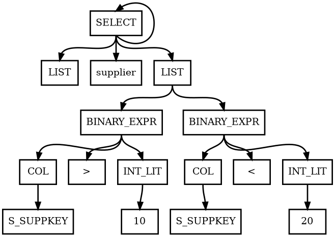


## 3.5 AST分析

在服务端代码中，每次我们接收到一个来自客户端的SQL语句时，我们都会先调用yacc提供的接口`yyparse()`函数对SQL的词法、语法、语义进行解析，构建AST树，构建的AST树存储在变量`ast::parse_tree`中。接着会执行以下代码，将AST树传给`analyse`模块进行分析。

```cpp
std::shared_ptr<Query> query = analyze->do_analyze(ast::parse_tree);
```

`do_analyse()`函数主要任务是对AST树进行分析，最后返回分析结果`query`。以DML语句为例，他会对AST树进行解析，然后DML语句的AST树转化为一个`Query`类型，`Query`的定义如下，它描述了一个DML语句的全部语义信息，包括：where条件、投影列、表名、update的set值、insert的values值、group by条件、having条件。`Query`类提供了更加全面且高层测的信息，方便我们在后续计划生成时候使用。

```cpp
class Query {
 public:
  std::shared_ptr<ast::TreeNode> parse;
  // where条件
  std::vector<Condition> conds;
  // 投影列
  std::vector<TabCol> cols;
  // 表名
  std::vector<std::string> tables;
  // update 的set 值
  std::vector<SetClause> set_clauses;
  // insert 的values值
  std::vector<Value> values;
  // group by条件
  std::vector<TabCol> groupby_cols;
  // having条件
  std::vector<Condition> having_conds;
};
```


## 3.6 查询计划生成

对于上一步分析的结果`query`，我们将会基于它生成查询计划。这里，我们执行以下代码来生成查询计划。

```cpp
std::shared_ptr<Plan> plan = optimizer->plan_query(query, context);
```

其中`plan_query()`函数的作用是根据上一部的分析结果，匹配对应的处理逻辑，生成查询计划。
以DML语句为例，在`plan_query()`中，最后要将结果存储到`DMLPlan`类中，这里面对`query`中的信息进行了进一步的解析和整理，更方便后续执行。

```cpp
class DMLPlan : public Plan {
 public:
  // 子计划
  std::shared_ptr<Plan> subplan_;
  // 表名称
  std::string tab_name_;
  // 值列表
  std::vector<Value> values_;
  // 条件列表
  std::vector<Condition> conds_;
  // 子句
  std::vector<SetClause> set_clauses_;
  bool unique_;  // unique select
};
```

## 3.7 查询计划的执行

上一步生成的查询计划会被传给`portal`执行。`portal`相当于是系统的入口，里面集成了很多executor，例如`executor_sort`、`executor_nestloop`、`executor_merge_join`、`executor_hash_join`、`executor_insert`、`executor_projection`等，它会根据查询计划的类型决定最后使用什么executor来进行执行。

```cpp
std::shared_ptr<PortalStmt> portalStmt = portal->start(plan, context);
portal->run(portalStmt, ql_manager.get(), &txn_id, context);
portal->drop();
```

具体来说，我们针对不同的SQL语句有以下几种处理：

### 3.7.1 CREATE TABLE 语句

#### 3.7.1.1 重要数据结构

- **`SmManager`**：系统管理器，管理元数据及表的DDL操作。
  - **`DbMeta`**：当前数据库的元数据，包括表和索引信息。
  - **`fhs_`**：记录每张表的数据文件句柄。
  - **`buffer_pool_manager_`**：负责内存和磁盘之间的数据页管理。
  - **`rm_manager_`**：记录管理器，用于创建和管理表文件。
- **`TabMeta`**：表的元数据。
  - **`name`**：表名称。
  - **`cols`**：表的字段元信息。
  - **`schema`**：表的字段模式。

#### 3.7.1.2 函数调用图

1. 检查表是否存在
   - 调用 `DbMeta::is_table` 检查当前表名是否已存在。
   - 存在则抛出 `TableExistsError`。
2. 构造表元数据
   - 创建表字段元数据（`ColMeta`）。
   - 构造字段模式（`Schema`）。
3. 创建表文件
   - 调用 `RmManager::CreateFile` 创建表文件。
   - 打开文件句柄，存入 `fhs_`。
4. 更新数据库元数据
   - 更新 `DbMeta` 中的表信息。
   - 调用 `SmManager::FlushMeta` 将元数据刷入磁盘。

#### 3.7.1.3 提供给其他模块的接口函数

- `SmManager::CreateTable`
  - **功能**：创建一个新表。
  - 参数：
    - `tab_name`：表的名称。
    - `col_defs`：表字段的定义。
    - `context`：执行上下文。
  - **返回值**：无。

#### 3.7.1.4 主要内部函数

- **`RmManager::CreateFile`**
  - **功能**：在磁盘中为新表创建记录文件。
  - 参数：
    - `file_name`：文件名。
    - `record_size`：记录大小。
  - **返回值**：无。
- **`RmManager::OpenFile`**
  - **功能**：打开表文件并返回句柄。
  - 参数：
    - `file_name`：文件名。
  - **返回值**：表文件句柄。
- **`FlushMeta`**
  - **功能**：将数据库元数据刷入磁盘。
  - **参数**：无。
  - **返回值**：无。

#### 3.7.1.5 CREATE TABLE 示例流程

```plaintext
输入：CREATE TABLE tab_name (id INT, name VARCHAR(50))
1. 检查是否已存在 tab_name 表。
2. 创建表元数据：字段 `id` 和 `name`。
3. 调用 `RmManager::CreateFile` 为表分配存储空间。
4. 打开表文件句柄并更新 `fhs_`。
5. 更新数据库元数据并调用 `FlushMeta`。
输出：表创建成功。
```


### 3.7.2. DROP TABLE 语句

#### 3.7.2.1 重要数据结构

- `SmManager`：系统管理器。
  - **`fhs_`**：记录每张表的数据文件句柄。
  - **`ihs_`**：记录每个索引文件句柄。
  - **`db_`**：数据库元数据，记录表和索引的信息。
  - **`rm_manager_`**：记录管理器，管理表文件的打开和销毁。
  - **`ix_manager_`**：索引管理器，负责删除表上的索引。

#### 3.7.2.2 函数调用图

1. 检查表是否存在
   - 调用 `DbMeta::is_table` 检查表名是否存在。
   - 不存在则抛出 `TableNotFoundError`。
2. 删除表上的索引
   - 遍历 `TabMeta::indexes` 中的索引列表。
   - 调用 `SmManager::DropIndex` 删除索引文件。
3. 删除表文件
   - 调用 `RmManager::CloseFile` 关闭文件句柄。
   - 调用 `BufferPoolManager::RemoveAllPages` 清理缓存。
   - 调用 `RmManager::DestoryFile` 删除文件。
4. 更新元数据
   - 从 `DbMeta::tabs_` 中移除表元数据。
   - 调用 `FlushMeta` 将更新后的元数据写入磁盘。

#### 3.7.2.3 提供给其他模块的接口函数

- `SmManager::DropTable`
  - **功能**：删除指定表及其索引。
  - 参数：
    - `tab_name`：表的名称。
    - `context`：执行上下文。
  - **返回值**：无。

#### 3.7.2.4 主要内部函数

- **`DropIndex`**
  - **功能**：删除表上的索引。
  - 参数：
    - `tab_name`：表名。
    - `col_names`：索引字段名。
    - `context`：执行上下文。
  - **返回值**：无。
- **`RmManager::DestoryFile`**
  - **功能**：从磁盘中删除指定文件。
  - 参数：
    - `file_name`：文件名。
  - **返回值**：无。
- **`BufferPoolManager::RemoveAllPages`**
  - **功能**：移除缓存中与表文件相关的所有页面。
  - 参数：
    - `file_id`：文件句柄。
  - **返回值**：无。

#### 3.7.2.5 DROP TABLE 示例流程

```plaintext
输入：DROP TABLE tab_name
1. 检查是否存在 tab_name 表。
2. 删除表上的所有索引。
3. 调用 `RmManager::CloseFile` 关闭表文件。
4. 调用 `RmManager::DestoryFile` 删除表文件。
5. 从 `DbMeta::tabs_` 中移除表元数据并调用 `FlushMeta`。
输出：表删除成功。
```


### 3.7.3. INSERT 语句

#### 3.7.3.1 重要数据结构

- `InsertExecutor`：负责插入操作的执行。
  - **`TabMeta`**：表的元数据，包含字段信息和索引信息。
  - **`values_`**：需要插入的值。
  - **`RmFileHandle`**：表的数据文件句柄，用于记录操作。
  - **`RID`**：插入记录的物理位置。
  - **`SmManager`**：系统管理器，用于管理表和索引元数据。

#### 3.7.3.2 函数调用图

1. 构造元组
   - 调用 `Tuple::Tuple` 使用插入值构造元组。
2. 插入记录
   - 调用 `RmFileHandle::InsertTuple` 将元组写入表文件，获取 `RID`。
3. 更新索引
   - 遍历表的索引，调用 `IxIndexHandle::InsertEntry` 在索引文件中插入对应键值对。
4. 更新元数据
   - 调用 `SmManager::UpdateTableCount` 更新表记录数。

#### 3.7.3.3 提供给其他模块的接口函数

- `InsertExecutor::Next`
  - **功能**：完成插入操作并返回插入结果。
  - **参数**：无。
  - **返回值**：空的 `Tuple` 对象。

#### 3.7.3.4 主要内部函数

- **`RmFileHandle::InsertTuple`**
  - **功能**：向表文件中插入记录。
  - 参数：
    - `TupleMeta`：元组的元信息。
    - `Tuple`：插入的元组。
  - **返回值**：插入记录的 `RID`。
- **`IxIndexHandle::InsertEntry`**
  - **功能**：向索引文件中插入键值对。
  - 参数：
    - `key`：索引键。
    - `rid`：记录的位置。
  - **返回值**：成功返回 0，失败返回 -1。
- **`SmManager::UpdateTableCount`**
  - **功能**：更新表的记录数。
  - 参数：
    - `tab_name`：表名。
    - `count`：增加或减少的记录数。
  - **返回值**：无。

#### 3.7.3.5 INSERT 示例流程

```plaintext
输入：INSERT INTO tab_name VALUES (1, 'John')
1. 构造元组 Tuple: [1, 'John']。
2. 调用 `RmFileHandle::InsertTuple` 将元组写入表文件，获取 RID。
3. 遍历表的索引，调用 `IxIndexHandle::InsertEntry` 更新索引。
4. 调用 `SmManager::UpdateTableCount` 增加表记录数。
输出：记录插入成功。
```

### 3.7.4. DELETE 语句

#### 3.7.4.1 重要数据结构

- `DeleteExecutor`：负责删除操作的执行。
  - **`TabMeta`**：表的元数据，包含字段信息和索引信息。
  - **`RmFileHandle`**：表的数据文件句柄，用于记录操作。
  - **`rids_`**：需要删除记录的位置列表。
  - **`SmManager`**：系统管理器，用于管理表和索引元数据。

#### 3.7.4.2 函数调用图

1. 遍历需要删除的记录
   - 遍历 `rids_` 获取每条记录。
2. 删除索引
   - 遍历表的索引，调用 `IxIndexHandle::DeleteEntry` 删除索引条目。
3. 删除记录
   - 调用 `RmFileHandle::DeleteTuple` 从表文件中删除记录。
4. 更新元数据
   - 调用 `SmManager::UpdateTableCount` 减少表记录数。

#### 3.7.4.3 提供给其他模块的接口函数

- `DeleteExecutor::Next`
  - **功能**：完成删除操作并返回删除结果。
  - **参数**：无。
  - **返回值**：空的 `Tuple` 对象。

#### 3.7.4.4 主要内部函数

- **`RmFileHandle::GetTupleValue`**
  - **功能**：根据 `RID` 获取记录值。
  - 参数：
    - `rid`：记录的位置。
  - **返回值**：记录的值。
- **`IxIndexHandle::DeleteEntry`**
  - **功能**：从索引文件中删除键值对。
  - 参数：
    - `key`：索引键。
  - **返回值**：无。
- **`RmFileHandle::DeleteTuple`**
  - **功能**：从表文件中删除记录。
  - 参数：
    - `rid`：记录的位置。
  - **返回值**：无。
- **`SmManager::UpdateTableCount`**
  - **功能**：更新表的记录数。
  - 参数：
    - `tab_name`：表名。
    - `count`：增加或减少的记录数。
  - **返回值**：无。

#### 3.7.4.5 DELETE 示例流程

```plaintext
输入：DELETE FROM tab_name WHERE id = 1
1. 根据条件找到需要删除的记录 RID 列表。
2. 遍历 RID 列表，调用 `RmFileHandle::GetTupleValue` 获取记录值。
3. 调用 `IxIndexHandle::DeleteEntry` 删除记录在索引中的键值对。
4. 调用 `RmFileHandle::DeleteTuple` 从表文件中删除记录。
5. 调用 `SmManager::UpdateTableCount` 减少表记录数。
输出：记录删除成功。
```


### 3.7.5. SELECT 语句

#### 3.7.5.1 重要数据结构

- `AbstractExecutor`：查询执行器的抽象基类，负责处理不同类型的查询操作。
  - **`beginTuple()`**：初始化查询，准备开始遍历记录。
  - **`Next()`**：获取下一个符合条件的元组（记录）。
  - **`IsEnd()`**：检查查询是否已结束。
  - **`schema()`**：返回查询结果的模式（字段信息）。
- `RecordPrinter`：负责将查询结果格式化并输出到指定位置。
  - **`print_separator()`**：输出分隔符，用于格式化记录。
  - **`print_record()`**：输出单条记录。
  - **`print_record_count()`**：输出查询结果的记录数。

#### 3.7.5.2 函数调用图

1. 初始化列标题
   - 生成查询结果的列标题 `captions`。
2. 打印表头
   - 使用 `RecordPrinter::print_separator` 和 `RecordPrinter::print_record` 打印表头和列标题。
3. 执行查询
   - 调用 `executorTreeRoot->beginTuple` 初始化查询，遍历每个元组。
   - 使用 `executorTreeRoot->Next` 获取查询的每一行数据。
4. 打印记录
   - 对每一行记录，检查值是否为空（`tuple->IsNull`），并使用 `Value::ToString` 转换值为字符串形式。
   - 使用 `RecordPrinter::print_record` 输出每一行数据。
5. 打印表尾
   - 使用 `RecordPrinter::print_separator` 打印表尾分隔符。
   - 使用 `RecordPrinter::print_record_count` 打印查询结果的记录数量。

#### 3.7.5.3 提供给其他模块的接口函数

- `QlManager::select_from`
  - **功能**：执行 SELECT 查询，输出查询结果。
  - 参数：
    - `executorTreeRoot`：查询执行器的根节点，用于执行查询操作。
    - `sel_cols`：查询的列信息，包含列名及可能的聚合操作。
    - `context`：上下文信息，包含输出位置、格式化等信息。
  - **返回值**：无。

#### 3.7.5.4 主要内部函数

- **`executorTreeRoot->beginTuple`**
  - **功能**：初始化查询，准备遍历结果集。
  - **参数**：无。
  - **返回值**：无。
- **`executorTreeRoot->Next`**
  - **功能**：获取下一条符合条件的记录。
  - **参数**：无。
  - **返回值**：返回一个 `Tuple` 对象，表示查询结果的一行。
- **`executorTreeRoot->IsEnd`**
  - **功能**：检查查询是否结束。
  - **参数**：无。
  - **返回值**：返回布尔值，若查询已结束则返回 `true`，否则返回 `false`。
- **`RecordPrinter::print_separator`**
  - **功能**：打印列分隔符。
  - 参数：
    - `context`：上下文对象，包含输出目标。
  - **返回值**：无。
- **`RecordPrinter::print_record`**
  - **功能**：打印单条记录。
  - 参数：
    - `columns`：记录的字段数据（每个字段是字符串形式）。
    - `context`：上下文对象，包含输出目标。
  - **返回值**：无。
- **`RecordPrinter::print_record_count`**
  - **功能**：打印记录数。
  - 参数：
    - `num_rec`：查询结果中的记录数。
    - `context`：上下文对象，包含输出目标。
  - **返回值**：无。

#### 3.7.5.5 SELECT 示例流程

```plaintext
输入：SELECT col1, col2 FROM tab_name
1. 初始化查询执行器，开始遍历表中的记录。
2. 生成列标题列表 `captions`，并打印表头。
3. 使用 `beginTuple` 初始化查询，逐行遍历记录。
4. 对于每一条记录，检查是否为空（`IsNull`），并通过 `ToString` 转换为字符串。
5. 使用 `RecordPrinter::print_record` 打印每条记录。
6. 查询结束后，使用 `RecordPrinter::print_record_count` 打印查询结果的记录数。
输出：查询结果被打印在指定格式的输出中。
```

### 3.8 数据字典

经过DDL语句的执行，我们会将表的元数据保存到文件中。示例SQL代码如下：

```sql
CREATE TABLE supplier(
    S_SUPPKEY INTEGER NOT NULL,
    S_NAME CHAR(25) NOT NULL,
    S_ADDRESS VARCHAR(40) NOT NULL,
    S_NATIONKEY INTEGER NOT NULL,
    S_PHONE CHAR(15) NOT NULL,
    S_ACCTBAL FLOAT NOT NULL,
    S_COMMENT VARCHAR(101) NOT NULL
);
```

则表supplier对应的数据字典如下，文件中记录的内容能够清楚地描述supplier这个表的所有属性。

```
supplier
7
supplier S_SUPPKEY 1 4 0 0
supplier S_NAME 6 25 4 0
supplier S_ADDRESS 6 40 29 0
supplier S_NATIONKEY 1 4 69 0
supplier S_PHONE 6 15 73 0
supplier S_ACCTBAL 3 4 88 0
supplier S_COMMENT 6 101 92 0
0
Schema[NumColumns:7, IsInlined:0, Length:32] :: (S_SUPPKEY:TYPE_INT, S_NAME:TYPE_VARCHAR(25), S_ADDRESS:TYPE_VARCHAR(40), S_NATIONKEY:TYPE_INT, S_PHONE:TYPE_VARCHAR(15), S_ACCTBAL:DECIMAL, S_COMMENT:TYPE_VARCHAR(101))
```


# 4 查询优化

## 4.1 逻辑优化

### 4.1.1 连接重排

对于两表的连接查询 

```sql
SELECT * FROM A,B WHERE A.x = B.y;
-- (假设B是小表)
```

在解析完语法之后对conds条件进行重排,确保给join execution的条件是B.y驱动A.x,即修改小表在前,大表在后.即修改后语句变为

``` sql
SELECT * FROM A,B WHERE B.y = A.x;
```

> 注：
>
> 对于三表查询,A.a = B.a AND B.b = C.b,假设(T(A)\*T(B)>T(B)\*T(C),T(A)>T(B)>T(C)),优化后会把BC连接放前面,AB连接放后面,即优化后变为C.b = B.c AND B.a = A.a

### 4.1.2 单表前移

对于两表的连接查询 

``` sql
SELECT * FROM A,B WHERE A.x = B.y AND A.z = 10;(假设B是小表)
```

然后对于单表条件A.z = 10会对它进行前移,优化后SQL语句变为

``` sql
SELECT * FROM A,B WHERE A.z = 10 AND A.x = B.y ;
```

### 4.1.3 下推选择

对于两表的连接查询 

``` sql
SELECT * FROM A,B WHERE A.x = B.y AND A.x OP 10;
```

在解析语法之后的cons里添加条件,B.y=10再进行执行,即优化后执行变为

```sql
SELECT * FROM A,B WHERE B.y = 10 AND A.x = B.y AND A.x = 10;
```

> 注：
> 对于OP可以是任何操作符,并且支持多选择下推即 A.a = B.a AND B.a = C.c AND A.a OP 10 会优化为 B.a OP 10 AND C.c OP 10 AND A.a = B.a AND B.a = C.c AND A.a OP 10

### 4.1.4 条件剪枝

对于两表的连接查询 

``` sql
SELECT * FROM A,B WHERE A.x = B.y AND A.a = 10 AND A.a<30 AND A.a<20;
```

在解析语法之后对conds剪枝,会把条件剪枝为A.a=10,即优化后的SQL语句变为

```sql 
SELECT * FROM A,B WHERE A.x = B.y AND A.a = 10;
```

而对应查询 

```sql
SELECT * FROM A WHERE a = 10 AND a=20; 或者 SELECT * FROM A WHERE a = 10 AND a=20;
```

会判断条件不成立,不再对SQL语句进行执行,直接全部剪枝并且返回empty set

### 4.1.5 优化整合

对于我们数据库中的实际使用,我们通过上面的顺序进行逻辑优化,即优化顺序为连接重排、单表前移、下推选择、条件剪枝,这样就得到优化后的语句,下面给出例子

``` sql
SELECT * FROM A,B,C WHERE A.x = B.y AND B.y = C.z AND A.x<20 AND A.x = 10 AND C.z < 20;
-- 这里(T(A)*T(B)>T(B)*T(C),T(A)>T(B)>T(C))
```

优化后的SQL语句为:

```sql 
SELECT * FROM A,B,C WHERE A.x = 10 AND B.y=10 AND C.z = 10 AND C.z = B.y AND B.y = A.x ;
```

## 4.2 物理优化

### 4.2.1 统计信息管理

在数据load阶段，对数据的MAX、MIN、COUNT、SUM、DISCTINC_VALUE进行统计，动态维护以下信息，用于**聚合查询**以及**启发式多表连接顺序选择**。

```c++
std::unordered_map<std::string, int> table_count_;
std::unordered_map<std::string, std::unordered_map<std::string, float>> table_attr_max_;
std::unordered_map<std::string,std::unordered_map<std::string, float>> table_attr_min_;
std::unordered_map<std::string,std::unordered_map<std::string, float>> table_attr_sum_;
std::unordered_map<std::string,std::unordered_map<std::string, int>> table_attr_distinct_;
```

### 4.2.2 基于统计信息的聚合查询

`AggregationExecutor` 支持 基于统计信息的SQL 聚合操作（如 `COUNT`、`SUM`、`MAX` 和 `MIN`）的关键组件。通过直接使用统计信息，减少数据的扫描和计算，实现数据重用。

#### 4.2.2.1 `AggregationExecutor` 设计

`AggregationExecutor` 用于执行包含聚合操作的 SQL 查询，查询支持结果列重命名。示例查询包括：

- `SELECT SUM(score) AS sum_score FROM grade;`
- `SELECT COUNT(*) AS row_num, COUNT(id) AS student_num FROM grade;`
- `SELECT id, MAX(score) AS max_score, MIN(score) AS min_score FROM grade;`

#### 4.2.2.2 支持的聚合类型

执行器支持以下聚合类型：

- **SUM_AGG：** 返回列值的总和。
- **COUNT_AGG：** 返回元组的计数。
- **MAX_AGG：** 检索列中的最大值。
- **MIN_AGG：** 检索列中的最小值。

#### 4.2.2.3 关键特性

1. **列模式转换：** 根据聚合类型自动调整模式，并确保与输入数据类型兼容。
2. **聚合逻辑：** 通过与 `SmManager` 接口交互，获取表级统计信息来高效计算聚合结果。
3. **动态列命名：** 使用基于聚合类型的一致命名约定生成新列名（例如 `SUM(score)`）。

### 4.2.3 连接重排序

对于多表连接，基于表元组数据以及distinct值的统计信息，计算中间结果大小。通过将中间结果小的连接前置，来减小连接操作开销。

$$
cost=COUNT(R)*COUNT(S)/MAX(DISTINCT(R,A),DISTINCT(S,A))
$$


# 5 使用手册

## 5.1 编译

```shell
# 先进入到项目目录
cd /path/to/easydb

# 新建build目录并进入
mkdir build
cd build

# 使用cmake编译项目
cmake ..
make -j
```

## 5.2 运行

```shell
# 进入到build/bin/目录下
cd build/bin/

# 启动服务端
./easydb_server -d test.db -p 8765

# 启动客户端
./easydb_client -p 8765

# 在客户段中输入help;可以查看帮助信息
# 在客户端中执行SQL语句即可查看到执行的结果，如：
SELECT * FROM supplier WHERE S_NAME = 'Supplier#000000003';
```

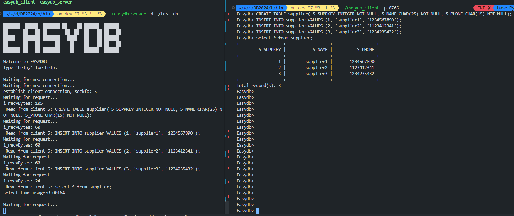

## 5.3 AST可视化

```shell
# 进入到build/test目录下
cd build/test/

# 运行parser_ast_printer
./parser_ast_printer -s "SELECT * FROM supplier;" -o ast.dot

# 使用dot可视化
dot -T svg ast.dot -o ast.svg
```

我们运行parser_ast_printer来打印出SQL语句的AST树对应的dot描述，然后再使用dot命令将dot文件转化成svg就可以使用浏览器查看。

# 6 测试方案与结果

## 6.1 测试设计与实现

我们使用SQL语句进行测试，为了能够更方便地进行测试，我们编写了一个测试脚本，该脚本可以自动启动服务端和和客户端，导入测试数据，并执行SQL语句，然后输出结果。该脚本放在根目录下的`test/parser/parser_test.sh`。

### 6.1.1 服务端的启动和关闭

我们的数据库系统是C/S架构的，因此每次在执行SQL语句之前，需要将服务端启动。这里我们使用bash脚本进行启动，将stdout和stderr都重定向到日志文件中，以便后续查看。我们的服务端是在后台运行的，因此需要等待一段时间，以便服务端启动完成。这里我们使用sleep函数等待一段时间，然后检查服务端是否已经启动完成。

```shell
# 首先启动server
print_green "启动server"
$SERVER_PATH -d $DB_PATH -p $SERVE_PORT > $SERVER_LOG_PATH 2>&1  &
sleep 10
```

在我们完成测试的所有操作之后，运行在后台的服务端也需要关闭，这里我们使用kill命令关闭服务端进程。

```shell
clean_up(){
    # print_red "执行清理操作"
    ps -aux | grep easydb | grep $(whoami) | awk '{print $2}' | xargs kill -9 > /dev/null 2>&1
}
# 退出时调用clean_up函数关闭Server进程
trap clean_up EXIT;
```

### 6.1.2 SQL语句的执行

为了能够优雅地在脚本中执行SQL语句，我们将执行SQL语句的命令封装成了一个函数，该函数接受一个参数，即SQL语句。然后我们会启动一个客户端连接到服务端，执行了该SQL语句后关闭该客户端。具体来说，我们使用了execute函数实现该功能。我们将语句从管道中传入到客户端的stdin中，执行完毕后，客户端会自动退出。

```shell
execute(){
    print_blue "执行命令: $1"
    echo "$1; exit;" | $CLIENT_PATH -p $SERVE_PORT
}
```

### 6.1.3 测试数据的导入

我们的数据库实现了load命令，该命令能够从文件中读取并导入数据到数据库中。所以，我们可以使用以下的shell命令将测试数据导入到数据库中。

```shell
execute "load $DATA_SUPPLIER_PATH into supplier;"
```

### 6.1.4 AST可视化

我们使用脚本运行写好的`parser_ast_printer`来完成该任务，具体来说，我们实现了`draw_ast()`函数来完成该功能。
该函数会将SQL语句字符串，通过调用`parser_ast_printer`转化为dot文件，最后再调用`dot`命令将dot文件转换为png文件。

```shell
draw_ast(){
    DOT_OUT_PATH=$DOT_ROOT/SQL$SQL_DOT_NUM.dot
    SVG_OUT_PATH=$DOT_ROOT/SQL$SQL_DOT_NUM.png
    SQL_DOT_NUM=$((SQL_DOT_NUM + 1))
    echo "$1"
    $ROOT_PATH/build/test/parser_ast_printer -s "$1" -o $DOT_OUT_PATH 
    dot -T png $DOT_OUT_PATH -o $SVG_OUT_PATH 
}
```

### 6.1.5 小数据集测试点设置

为了能够更加全面地测试我们的数据库系统，我们需要设置一些测试点。为了方便验证增删改查的正确性，我们在小数据集上设计了以下测试点。

1. Create Table相关测试

    这部分主要测试create语句的解析和执行情况，测试的表格中有INT，CHAR，DATETIME类型的字段。
    这里我们新建3个表格。student表、teacher表、course表和sc表。他们分别表示学生表、教室表、课程表和学生选课表。

    ```shell
    create_table_student=$(cat <<EOF
    CREATE TABLE student(\
        s_id INTEGER NOT NULL,\
        s_name VARCHAR(25) NOT NULL,\
        s_age INTEGER NOT NULL,\
        s_birthday DATETIME\
    );
    EOF
    )
    execute "$create_table_student"

    create_table_teacher=$(cat <<EOF
    CREATE TABLE teacher(\
        t_id INTEGER NOT NULL,\
        t_name VARCHAR(25) NOT NULL,\
        t_age INTEGER NOT NULL,\
        t_birthday DATETIME\
    );
    EOF
    )
    execute "$create_table_teacher"

    create_table_course=$(cat <<EOF
    CREATE TABLE course(\
        c_id INTEGER NOT NULL,\
        c_name VARCHAR(25) NOT NULL,\
        c_teacher INTEGER\
    );
    EOF
    )
    execute "$create_table_course"

    create_table_student_course=$(cat <<EOF
    CREATE TABLE sc(\
        sc_sid INTEGER NOT NULL,\
        sc_cid INTEGER NOT NULL\
    );
    EOF
    )
    execute "$create_table_student_course"
    ```

2. Insert相关测试

    这部分主要是测试Insert语句的解析和执行。我们会向之前定义的表中添加数据，所以我们设计了如下测试点：

    ```shell
    print_green "=> Insert"
    
    execute "INSERT INTO student values(5, 'aaa', 21, '1996-01-23');"
    execute "INSERT INTO student values(1, 'bbb', 25, '2001-02-03');"
    execute "INSERT INTO student values(4, 'ccc', 30, '2002-01-23');"
    execute "INSERT INTO student values(2, 'ddd', 22, '1994-08-12');"
    execute "INSERT INTO student values(3, 'eee', 35, '2000-01-23');"
    execute "INSERT INTO student values(3, 'eee', 35, '2000-01-23');"
    execute "INSERT INTO student values(6, 'fff', 35, '1999-01-23');"
    
    execute "INSERT INTO teacher values(1, 'aaa', 35, '1999-01-23');"
    execute "INSERT INTO teacher values(2, 'ddd', 49, '1979-01-23');"
    execute "INSERT INTO teacher values(3, 'bbb', 50, '1959-01-23');"
    execute "INSERT INTO teacher values(4, 'ccc', 33, '1993-01-23');"
    
    execute "INSERT INTO course values(1, 'math', 1);"
    execute "INSERT INTO course values(2, 'english', 2);"
    execute "INSERT INTO course values(3, 'dbms', 3);"
    
    execute "INSERT INTO sc values(1, 1);"
    execute "INSERT INTO sc values(2, 1);"
    execute "INSERT INTO sc values(3, 1);"
    execute "INSERT INTO sc values(4, 1);"
    execute "INSERT INTO sc values(5, 1);"
    execute "INSERT INTO sc values(1, 2);"
    execute "INSERT INTO sc values(3, 2);"
    execute "INSERT INTO sc values(5, 2);"
    execute "INSERT INTO sc values(2, 3);"
    execute "INSERT INTO sc values(4, 3);"
    execute "INSERT INTO sc values(5, 3);"
    execute "INSERT INTO sc values(6, 3);"
    ```


3. Select相关测试

    这部分主要是测试select语句的解析和执行情况，包括简单查询，带条件的查询，带order by的查询和带unique的查询。主要有以下几个测试点：

    ```shell
    print_green "=> Select"

    # 测试SELECT语句基本用法
    execute "SELECT * FROM student;"

    print_green "==> order"
    # 测试SELECT语句带order by操作
    execute "SELECT * FROM student order by s_age;"

    print_green "==> unique"
    # 测试SELECT语句带unique操作
    execute "SELECT UNIQUE * FROM student;"

    print_green "==> condition"
    # 测试SELECT语句带条件
    execute "SELECT * FROM student where s_age = 35;"

    print_green "===> condition order"
    # 测试SELECT语句带条件和order by
    execute "SELECT * FROM student where s_age = 35 order by s_birthday;"

    print_green "===> condition unique"
    # 测试SELECT语句带条件和unique
    execute "SELECT UNIQUE * FROM student where s_age = 35;"
    ```

4. Delete相关测试

    这部分主要是测试Delete语句的解析和执行，不失其一般性，我们设计一个测试点即可。
    这里我们选择删除表student中的s_id为6的学生，后面的select语句是检验delete语句是否实现其功能。

    ```shell
    print_green "=> Delete"
    execute "delete from student where s_id = 6;"
    execute "select * from student;"
    ```

5. Drop相关测试
   
    这部分主要是测试Drop语句的解析和执行，不失其一般性，我们设计一个测试点即可。
    这里我们选择删除表`studen`t和`teacher`。

    ```shell
    print_green "=> Drop Table"
    execute "show tables;"
    execute "drop table student;"
    execute "drop table teacher;"
    execute "show tables;"
    ```

6. 语法错误提示相关测试

    这部分主要是测试当用户输入了一个语法错误的SQL语句时，我们的系统能否提示语法错误。
    这里我们设计了以下两个测试点：

    ```shell 
    print_green "=> syntax error"
    execute "select * from student where s_id = ;"
    execute "insert student values() ;"
    ```

### 6.1.6 大数据集测试点设置

为了对我们数据库的进行更加全面的测试，我们使用了TPC-H数据集进行测试，测试的内容主要是创建表格、创建索引、Select、Join等。
我们设置了以下几个测试点：


1. Create Table相关测试

    这部分主要测试create语句的解析和执行情况，测试的表格中有INT，CHAR，DATETIME类型的字段。

    ```shell
    create_table_nation=$(cat <<EOF
    CREATE TABLE nation(\
        N_NATIONKEY INTEGER NOT NULL,\
        N_NAME CHAR(25) NOT NULL,\
        N_REGIONKEY INTEGER NOT NULL,\
        N_COMMENT VARCHAR(152)\
    );
    EOF
    )
    execute "$create_table_nation"

    create_table_region=$(cat <<EOF
    CREATE TABLE region(\
        R_REGIONKEY INTEGER NOT NULL,\
        R_NAME CHAR(25) NOT NULL,\
        R_COMMENT VARCHAR(152)\
    );
    EOF
    )

    execute "$create_table_region"

    create_table_part=$(cat <<EOF
    CREATE TABLE part(\
        P_PARTKEY INTEGER NOT NULL,\
        P_NAME VARCHAR(55) NOT NULL,\
        P_MFGR CHAR(25) NOT NULL,\
        P_BRAND CHAR(10) NOT NULL,\
        P_TYPE VARCHAR(25) NOT NULL,\
        P_SIZE INTEGER NOT NULL,\
        P_CONTAINER CHAR(10) NOT NULL,\
        P_RETAILPRICE FLOAT NOT NULL,\
        P_COMMENT VARCHAR(23) NOT NULL\
    );
    EOF
    )
    execute "$create_table_part"

    create_table_supplier=$(cat <<EOF
    CREATE TABLE supplier(\
        S_SUPPKEY INTEGER NOT NULL,\
        S_NAME CHAR(25) NOT NULL,\
        S_ADDRESS VARCHAR(40) NOT NULL,\
        S_NATIONKEY INTEGER NOT NULL,\
        S_PHONE CHAR(15) NOT NULL,\
        S_ACCTBAL FLOAT NOT NULL,\
        S_COMMENT VARCHAR(101) NOT NULL\
    );
    EOF
    )
    execute "$create_table_supplier"

    create_table_customer=$(cat <<EOF
    CREATE TABLE customer(\
        C_CUSTKEY INTEGER NOT NULL,\
        C_NAME VARCHAR(25) NOT NULL,\
        C_ADDRESS VARCHAR(40) NOT NULL,\
        C_NATIONKEY INTEGER NOT NULL,\
        C_PHONE CHAR(15) NOT NULL,\
        C_ACCTBAL FLOAT NOT NULL,\
        C_MKTSEGMENT CHAR(10) NOT NULL,\
        C_COMMENT VARCHAR(117) NOT NULL\
    );
    EOF
    )

    execute "$create_table_customer"

    create_table_orders=$(cat <<EOF
    CREATE TABLE orders(\
        O_ORDERKEY INTEGER NOT NULL,\
        O_CUSTKEY INTEGER NOT NULL,\
        O_ORDERSTATUS CHAR(1) NOT NULL,\
        O_TOTALPRICE FLOAT NOT NULL,\
        O_ORDERDATE DATETIME NOT NULL,\
        O_ORDERPRIORITY CHAR(15) NOT NULL,\
        O_CLERK CHAR(15) NOT NULL,\
        O_SHIPPRIORITY INTEGER NOT NULL,\
        O_COMMENT VARCHAR(79) NOT NULL\
    );
    EOF
    )
    execute "$create_table_orders"

    create_table_lineitem=$(cat <<EOF
    CREATE TABLE lineitem(\
        L_ORDERKEY INTEGER NOT NULL,\
        L_PARTKEY INTEGER NOT NULL,\
        L_SUPPKEY INTEGER NOT NULL,\
        L_LINENUMBER INTEGER NOT NULL,\
        L_QUANTITY FLOAT NOT NULL,\
        L_EXTENDEDPRICE FLOAT NOT NULL,\
        L_DISCOUNT FLOAT NOT NULL,\
        L_TAX FLOAT NOT NULL,\
        L_RETURNFLAG CHAR(1) NOT NULL,\
        L_LINESTATUS CHAR(1) NOT NULL,\
        L_SHIPDATE DATETIME NOT NULL,\
        L_COMMITDATE DATETIME NOT NULL,\
        L_RECEIPTDATE DATETIME NOT NULL,\
        L_SHIPINSTRUCT CHAR(25) NOT NULL,\
        L_SHIPMODE CHAR(10) NOT NULL,\
        L_COMMENT VARCHAR(44) NOT NULL\
    );
    EOF
    )
    execute "$create_table_lineitem"
    ```

2. Select相关测试

    这部分主要测试select语句的解析和执行情况，测试涉及到等值，不等值，复杂条件的查询。
    设计的测试点如下：

    ```shell
    print_green "-------- Select Test --------"
    execute "SELECT * FROM supplier where S_SUPPKEY = 10;"
    execute "SELECT * FROM supplier where S_SUPPKEY > 10 AND S_SUPPKEY < 20;"
    ```

3. Join相关测试

    这部分主要测试Join语句的解析和执行情况，测试涉及到等值，不等值，多表连接。
    设计的测试点如下：

    ```shell
    print_green "=> 单条件等值连接"
    print_green "==> 单条件等值连接"
    
    execute "SELECT * FROM supplier, nation where S_SUPPKEY < 10 AND S_NATIONKEY = N_NATIONKEY;"
    
    print_green "=> 单条件不等值连接"
    execute "SELECT * FROM supplier, customer where S_SUPPKEY < 100 AND C_CUSTKEY < 100 AND S_PHONE != C_PHONE;"
    
    print_green "=> 多条件连接"
    print_green "==> int, varchar上进行多条件连接"
    execute "SELECT * FROM supplier, customer where S_SUPPKEY < 10 AND C_CUSTKEY < 10 AND S_PHONE != C_PHONE AND S_SUPPKEY != C_CUSTKEY;"
    
    print_green "=> 三表连接"
    execute "SELECT S_NAME, C_NAME, N_NAME FROM supplier, customer, nation where S_SUPPKEY < 10 AND C_CUSTKEY < 10 AND S_NATIONKEY = N_NATIONKEY AND C_NATIONKEY = N_NATIONKEY;"
    
    print_green "=> 两表卡氏积连接"
    execute "SELECT * FROM supplier, customer where S_SUPPKEY < 10 AND C_CUSTKEY < 10;"
    ```

4.Aggregation相关测试

这部分主要测试Aggregation语句的解析和执行情况，测试涉及到MAX，MIN，SUM。
设计的测试点如下：

```bash
print_green "=> Aggregation Test"
execute "SELECT SUM(N_NATIONKEY) FROM nation;"
execute "SELECT MAX(S_SUPPKEY) FROM supplier;"
execute "SELECT MIN(S_SUPPKEY) FROM supplier;"
```


### 6.1.7 查询优化测试点设置

为了能够更好地体现优化效果，我们将在大数据集上进行查询优化测试。我们设置以下几个测试点：

```bash
execute_optimize "select * from supplier, nation WHERE S_SUPPKEY = N_NATIONKEY;"

execute_optimize "select * from supplier, nation WHERE S_SUPPKEY = N_NATIONKEY AND S_SUPPKEY<10000 AND S_SUPPKEY<20 AND S_SUPPKEY<10;"

execute_optimize "select * from supplier, nation WHERE S_NAME = 'Supplier#000000229' AND S_NAME = '123';"

execute_optimize "select * from supplier, nation WHERE S_SUPPKEY = N_NATIONKEY AND S_SUPPKEY<10 AND S_SUPPKEY>20;"

execute_optimize "select * from supplier, nation, region WHERE S_SUPPKEY = N_NATIONKEY AND N_NATIONKEY = R_REGIONKEY AND N_NATIONKEY < 5 AND R_REGIONKEY<10;"
```


## 6.2 小数据集结果展示

### 6.2.1 初始化数据库

1. 服务端启动


### 6.2.2 Create Table相关测试

1. student表
   
- SQL：
    ```sql
    CREATE TABLE student(
        s_id INTEGER NOT NULL,
        s_name VARCHAR(25) NOT NULL,
        s_age INTEGER NOT NULL,
        s_birthday DATETIME
    );
    ```
    
- 结果：

    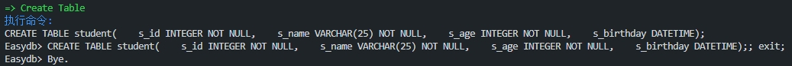

2. teacher表
   
- SQL：
    ```sql
    CREATE TABLE teacher(
        t_id INTEGER NOT NULL,
        t_name VARCHAR(25) NOT NULL,
        t_age INTEGER NOT NULL,
        t_birthday DATETIME
    );
    ```
    
- 结果：

    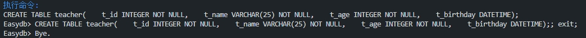


3. course表
   
- SQL：
    ```sql
    CREATE TABLE course(
        c_id INTEGER NOT NULL,
        c_name VARCHAR(25) NOT NULL,
        c_teacher INTEGER
    );
   ```
   
- 结果：

    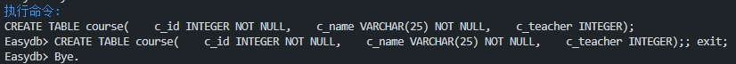

4. sc表
   
- SQL：
    ```sql
    CREATE TABLE sc(
        sc_sid INTEGER NOT NULL,
        sc_cid INTEGER NOT NULL
    );
    ```
    
- 结果：

    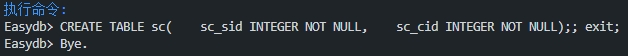


### 6.2.3 Insert相关测试

Insert语句的AST相似度比较高，因此我们只展示向`student`表插入记录的例子。

- SQL：
    ```sql
    INSERT INTO student values(5, 'aaa', 21, '1996-01-23');
    ```
    
- 结果：

    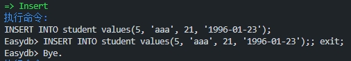

### 6.2.4 Select相关测试

1. **基础用法**
- SQL：
    ```sql
    SELECT s_id, s_name, s_age, s_birthday FROM student;
    ```
    
- 结果：

    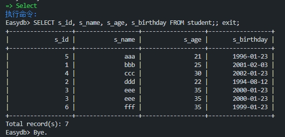

2. **带ORDER BY操作**
- SQL：
    ```sql
    SELECT s_id, s_name, s_age, s_birthday FROM student order by s_age;
    ```
    
- 结果：

    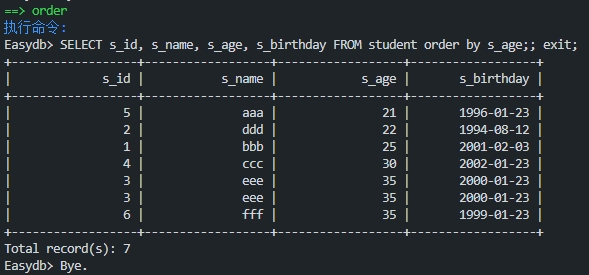


3. **带UNIQUE操作**
- SQL：
    ```sql
    SELECT UNIQUE s_id, s_name, s_age, s_birthday FROM student;
    ```
    
- 结果：

    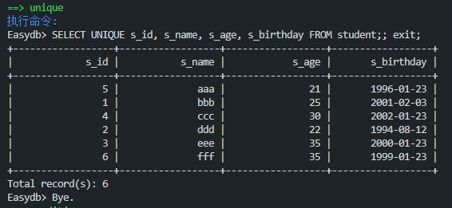

    可以看到，其中的重复项(3, 'eee', 35, '2000-01-23')只剩下了一项

4. **带条件**
- SQL：
    ```sql
    SELECT s_id, s_name, s_age, s_birthday FROM student WHERE s_age = 35;
    ```
    
- 结果：

    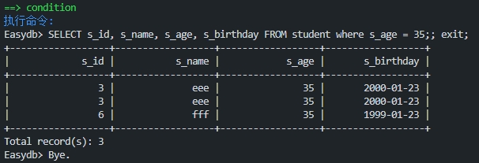

5. **带条件和ORDER BY**
- SQL：
    ```sql
    SELECT s_id, s_name, s_age, s_birthday FROM student WHERE s_age = 35 ORDER BY s_birthday;
    ```
    
- 结果：

    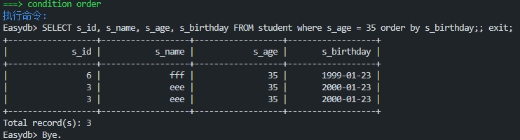

6. **带条件和UNIQUE**
- SQL：
    ```sql
    SELECT UNIQUE s_id, s_name, s_age, s_birthday FROM student WHERE s_age = 35;
    ```
    
- 结果：

    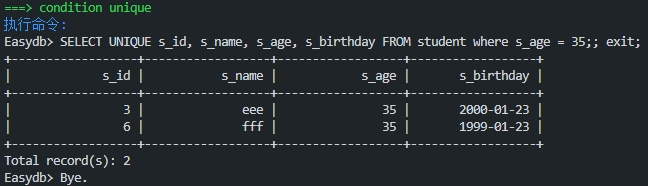

7. **带JOIN**
- SQL：
    ```sql
    SELECT s_id, s_name, s_age, s_birthday, c_name FROM student, course, sc WHERE s_id = sc_sid AND c_id = sc_cid;
    ```
    
- 结果：

    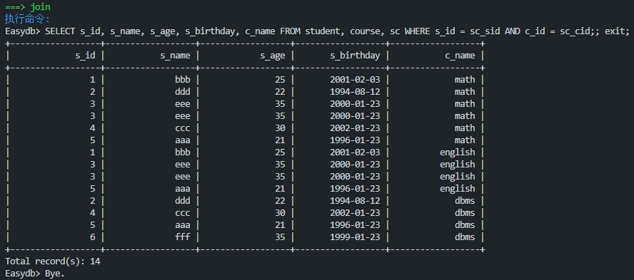


### 6.2.5 Delete相关测试

Delete语句的AST相似度比较高，因此我们只展示删除`student`表中`s_id`为6的记录的例子。

- SQL：
    ```sql
    DELETE FROM student WHERE s_id = 6;
    ```
    
- 结果：

    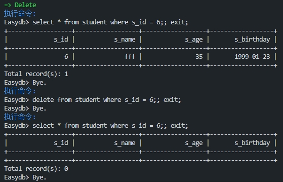

    可以看到，在我们执行`delete`操作之前，`student`表中是有`s_id`为6的记录的，但是在删除了之后，`student`表中就查询不到`s_id`为6的记录了。

### 6.2.6 Drop相关测试

DROP用于删除一个表，这里我们以删除`student`和`teacher`为例

- SQL：
    ```sql
    DROP TABLE student;
    DROP TABLE teacher;
    ```
    
- 结果：

    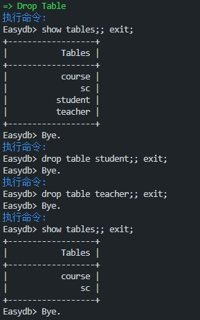

    可以看到，在我们执行`DROP`操作之前，数据库中存在着`student`、`teacher`、`course`、`sc`四个表，执行了两次`DROP`操作之后，数据库中仅剩`course`、`sc`两个表。

### 6.2.7 语法错误提示相关测试

1. **测试语句1**
- SQL：
    ```sql
    SELECT * FROM student WHERE s_id = ;
    ```

- 结果：

    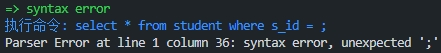

2. **测试语句2**
- SQL：
    ```sql
    INSERT student VALUES() ;
    ```

- 结果：

    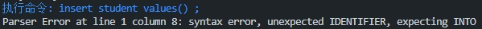

从上面的结果我们可以看出，当遇到语法错误时，我们的parser能够准确地判断出错误的行号和列号，以及可能的出错原因。


## 6.3 大数据集测试点展示

### 6.3.1 Create Table相关测试

1. **创建nation表**
   
- SQL：
    ```sql
    CREATE TABLE nation(
        N_NATIONKEY INTEGER NOT NULL,
        N_NAME CHAR(25) NOT NULL,
        N_REGIONKEY INTEGER NOT NULL,
        N_COMMENT VARCHAR(152)
    );
    ```

- 结果：

    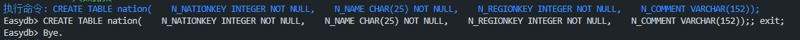

2. **创建region表**
   
- SQL：
    ```sql
    CREATE TABLE region(
        R_REGIONKEY INTEGER NOT NULL,
        R_NAME CHAR(25) NOT NULL,
        R_COMMENT VARCHAR(152)
    );
    ```

- 结果：

    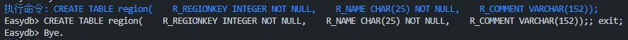

3. **创建part表**
   
- SQL：
    ```sql
    CREATE TABLE part(
        P_PARTKEY INTEGER NOT NULL,
        P_NAME VARCHAR(55) NOT NULL,
        P_MFGR CHAR(25) NOT NULL,
        P_BRAND CHAR(10) NOT NULL,
        P_TYPE VARCHAR(25) NOT NULL,
        P_SIZE INTEGER NOT NULL,
        P_CONTAINER CHAR(10) NOT NULL,
        P_RETAILPRICE FLOAT NOT NULL,
        P_COMMENT VARCHAR(23) NOT NULL
    );
    ```

- 结果：

    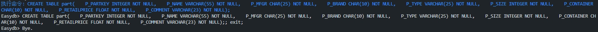

4. **创建supplier表**
   
- SQL：
    ```sql
    CREATE TABLE supplier(
        S_SUPPKEY INTEGER NOT NULL,
        S_NAME CHAR(25) NOT NULL,
        S_ADDRESS VARCHAR(40) NOT NULL,
        S_NATIONKEY INTEGER NOT NULL,
        S_PHONE CHAR(15) NOT NULL,
        S_ACCTBAL FLOAT NOT NULL,
        S_COMMENT VARCHAR(101) NOT NULL
    );
    ```

- 结果：

    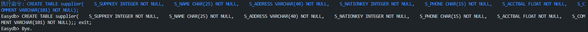

5. **创建customer表**
   
- SQL：
    ```sql
    CREATE TABLE customer(
        C_CUSTKEY INTEGER NOT NULL,
        C_NAME VARCHAR(25) NOT NULL,
        C_ADDRESS VARCHAR(40) NOT NULL,
        C_NATIONKEY INTEGER NOT NULL,
        C_PHONE CHAR(15) NOT NULL,
        C_ACCTBAL FLOAT NOT NULL,
        C_MKTSEGMENT CHAR(10) NOT NULL,
        C_COMMENT VARCHAR(117) NOT NULL
    );
    ```

- 结果：

    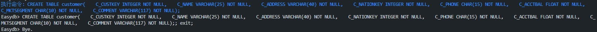

6. **创建orders表**
   
- SQL：
    ```sql
    CREATE TABLE orders(
        O_ORDERKEY INTEGER NOT NULL,
        O_CUSTKEY INTEGER NOT NULL,
        O_ORDERSTATUS CHAR(1) NOT NULL,
        O_TOTALPRICE FLOAT NOT NULL,
        O_ORDERDATE DATETIME NOT NULL,
        O_ORDERPRIORITY CHAR(15) NOT NULL,
        O_CLERK CHAR(15) NOT NULL,
        O_SHIPPRIORITY INTEGER NOT NULL,
        O_COMMENT VARCHAR(79) NOT NULL
    );
    ```

- 结果：

    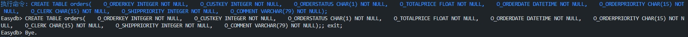

7. **创建lineitem表**
   
- SQL：
    ```sql
    CREATE TABLE lineitem(
        L_ORDERKEY INTEGER NOT NULL,
        L_PARTKEY INTEGER NOT NULL,
        L_SUPPKEY INTEGER NOT NULL,
        L_LINENUMBER INTEGER NOT NULL,
        L_QUANTITY FLOAT NOT NULL,
        L_EXTENDEDPRICE FLOAT NOT NULL,
        L_DISCOUNT FLOAT NOT NULL,
        L_TAX FLOAT NOT NULL,
        L_RETURNFLAG CHAR(1) NOT NULL,
        L_LINESTATUS CHAR(1) NOT NULL,
        L_SHIPDATE DATETIME NOT NULL,
        L_COMMITDATE DATETIME NOT NULL,
        L_RECEIPTDATE DATETIME NOT NULL,
        L_SHIPINSTRUCT CHAR(25) NOT NULL,
        L_SHIPMODE CHAR(10) NOT NULL,
        L_COMMENT VARCHAR(44) NOT NULL
    );
    ```

- 结果：

    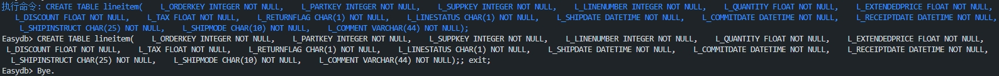


### 6.3.2 Select相关测试

1. **等值选择**
   
- SQL：
    ```sql
    SELECT * FROM supplier where S_SUPPKEY = 10;
    ```

- 结果：

    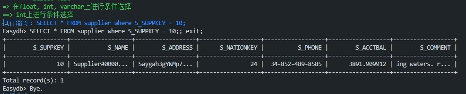

2. **不等值选择**
   
- SQL：
    ```sql
    SELECT * FROM supplier where S_SUPPKEY > 10 AND S_SUPPKEY < 20;
    ```

- 结果：

    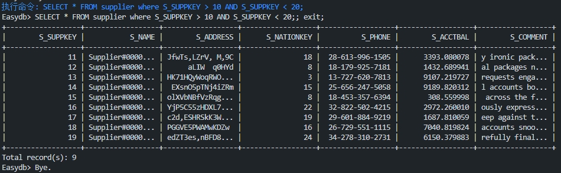

### 6.3.3 Join相关测试

1. **单条件等值连接**
   
- SQL：
    ```sql
    SELECT * FROM supplier, nation where S_SUPPKEY < 10 AND S_NATIONKEY = N_NATIONKEY;
    ```

- 结果：

    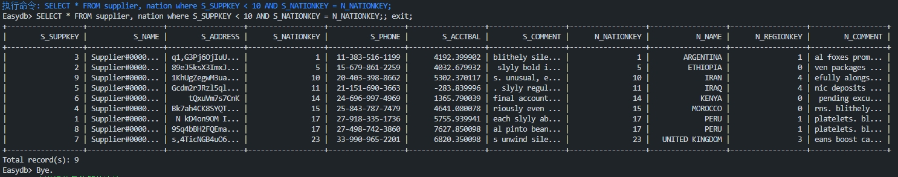

2. **单条件不等值连接**
   
- SQL：
    ```sql
    SELECT * FROM supplier, customer where S_SUPPKEY < 100 AND C_CUSTKEY < 100 AND S_PHONE != C_PHONE;
    ```

- 结果：

    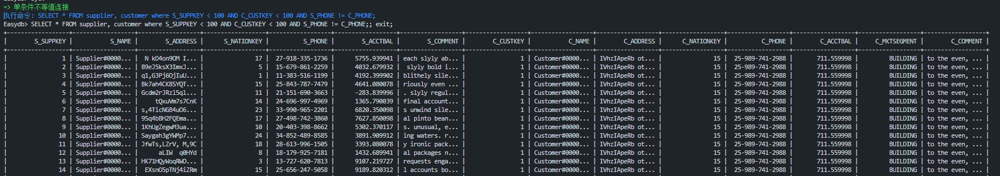


3. **多条件连接**
   
- SQL：
    ```sql
    SELECT * FROM supplier, customer where S_SUPPKEY < 10 AND C_CUSTKEY < 10 AND S_PHONE != C_PHONE AND S_SUPPKEY != C_CUSTKEY;
    ```

- 结果：

    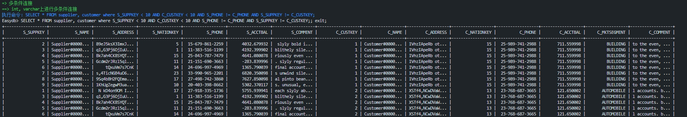

4. **三表连接**
   
- SQL：
    ```sql
    SELECT S_NAME, C_NAME, N_NAME FROM supplier, customer, nation where S_SUPPKEY < 10 AND C_CUSTKEY < 10 AND S_NATIONKEY = N_NATIONKEY AND C_NATIONKEY = N_NATIONKEY;
    ```

- 结果：

    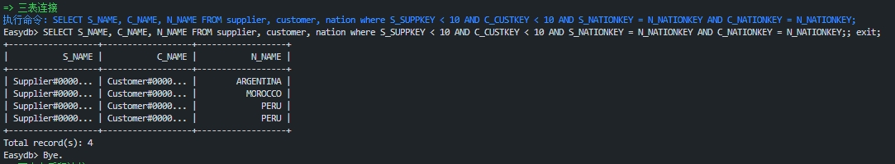

5. **两表卡氏积连接**
   
- SQL：
    ```sql
    SELECT * FROM supplier, customer where S_SUPPKEY < 10 AND C_CUSTKEY < 10;
    ```

- 结果：

    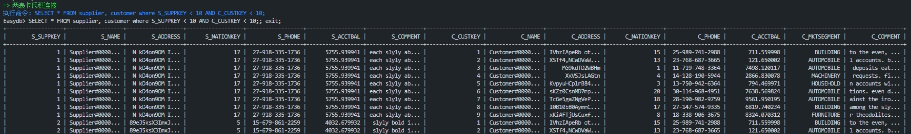

### 6.3.4 Aggregation相关测试

1. SUM

- SQL：

  ```sql
  SELECT SUM(N_NATIONKEY) FROM nation;
  ```

- 结果：

  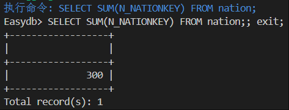

2. SUM

- SQL：

  ```sql
  SELECT MAX(S_SUPPKEY) FROM supplier;
  ```

- 结果：

  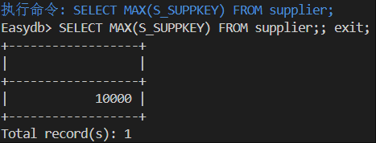

3. SUM

- SQL：

  ```sql
  SELECT MIN(S_SUPPKEY) FROM supplier;
  ```

- 结果：

  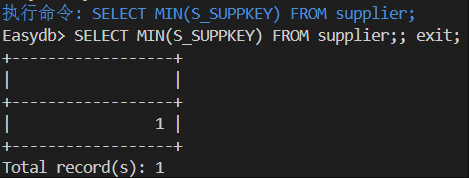

## 6.4 查询优化测试点展示

1. 

- SQL：

  ```sql
  select * from supplier, nation WHERE S_SUPPKEY = N_NATIONKEY;
  ```

- 未优化结果：

  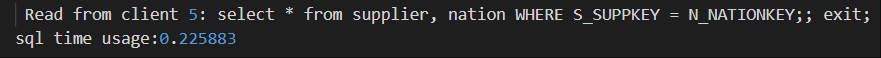

- 优化结果：

  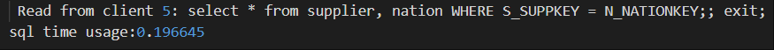


2. 

- SQL：

  ```sql
  select * from supplier, nation WHERE S_SUPPKEY = N_NATIONKEY AND S_SUPPKEY<10000 AND S_SUPPKEY<20 AND S_SUPPKEY<10;
  ```

- 未优化结果：

  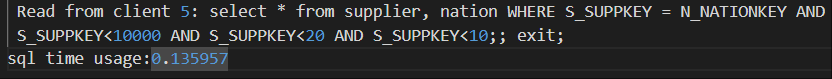

- 优化结果：

  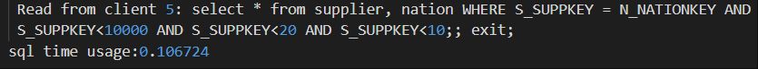


3. 

- SQL：

  ```sql
  select * from supplier, nation WHERE S_NAME = 'Supplier#000000229' AND S_NAME = '123';
  ```

- 未优化结果：

  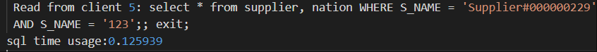

- 优化结果：

  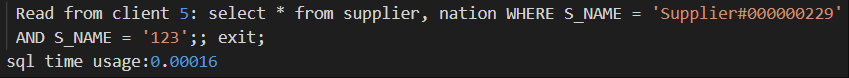

4. 

- SQL：

  ```sql
  select * from supplier, nation WHERE S_SUPPKEY = N_NATIONKEY AND S_SUPPKEY<10 AND S_SUPPKEY>20;
  ```

- 未优化结果：

  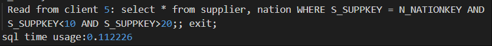

- 优化结果：

  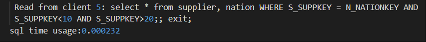

5. 

- SQL：

  ```sql
  select * from supplier, nation, region WHERE S_SUPPKEY = N_NATIONKEY AND N_NATIONKEY = R_REGIONKEY AND N_NATIONKEY < 5 AND R_REGIONKEY<10;
  ```

- 未优化结果：

  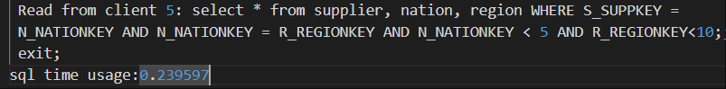

- 优化结果：

  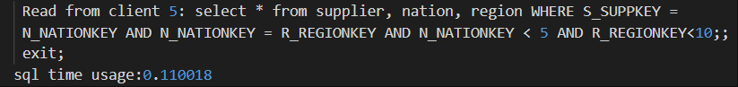


# 7 实验总结

在本次实验中，我们成功构建并实现了一个功能完备的数据库管理系统（DBMS），涵盖了从词法分析到查询执行的全过程。通过深入应用编译原理和数据库系统的核心概念，我们不仅提升了对数据库内部工作机制的理解，也增强了解决复杂问题的能力。以下是实验的主要成果和总结：

## 7.1 实验成果

1. **完整的DBMS组件实现**：我们实现了一个包含词法分析器、语法分析器、语义分析器、查询优化器和执行器的完整DBMS，支持SQL语言的核心功能。
2. **语义分析与AST构建**：我们实现了语义分析阶段，成功构建了抽象语法树（AST），为SQL语句的进一步处理提供了结构化表示。
3. **查询计划的生成与执行**：我们设计并实现了查询计划的生成和执行机制，使得数据库能够理解和执行复杂的SQL查询。
4. **查询优化**：我们设计并实现了基本的查询优化策略，完成了逻辑优化和物理优化，具体包括连接重排、单表前移、下推选择、条件剪枝等逻辑优化，基于统计信息的聚合查询优化以及连接重排序。
5. **C/S架构的实现**：我们搭建了客户端和服务端架构，使得用户可以通过客户端与数据库进行交互，实现了数据的远程操作和查询。
6. **全面的测试方案**：我们设计并执行了全面的测试方案，覆盖了数据库的各种操作，确保了系统的稳定性和可靠性。


## 7.2 系统特色

1. 全面的SQL支持：我们的数据库系统实现了对SQL语言的核心支持，包括数据定义、数据操纵和事务控制语句，为用户提供了强大的数据操作能力。
2. 高效的解析能力：利用flex和bison工具，我们的数据库系统能够高效地进行词法分析和语法分析，确保了SQL语句的快速准确解析。
3. 深入的语义分析与AST构建：我们的数据库系统不仅在语法层面解析SQL语句，还通过语义分析和AST构建深入理解语句的意图和结构，为后续的查询优化和执行打下坚实基础。
4. 查询优化器的实现：我们的数据库系统具备逻辑优化和物理优化功能，能够对查询进行优化，提高查询效率，减少资源消耗。
5. C/S架构的远程交互：采用客户端/服务端架构，支持远程数据操作和查询，提高了系统的可用性和灵活性。
6. AST可视化工具：开发了AST可视化工具，帮助用户和开发者直观理解SQL语句的结构，增强了系统的可读性和教育价值。
7. 自动化测试方案：实施了全面的自动化测试方案，确保了系统的稳定性和可靠性，同时也提高了测试效率。
8. 多表连接和聚合查询优化：系统支持多表连接查询，并能基于统计信息进行聚合查询优化，提升了复杂查询的性能。
9.  数据字典管理：系统能够将表的元数据保存到文件中，实现了数据字典的管理，便于数据的维护和恢复。
10. 错误处理和反馈：系统能够准确判断并提示语法错误，提供错误行号和列号，以及可能的错误原因，增强了用户体验。

## 7.2 遇到的问题与解决方案

1. **多用户并发控制**：在实现C/S架构时，我们面临多用户并发访问的问题。后续我们会通过引入事务管理和锁机制，这将有效地解决了并发控制问题。

2. **测试覆盖度**：在测试过程中，我们发现测试用例覆盖度不足。我们通过编写自动化测试脚本来增加测试用例，提高了测试的覆盖度和自动化水平。

## 7.3 实验心得

本次实验不仅加深了我们对数据库系统工作原理的理解，也锻炼了我们的编程能力和问题解决能力。我们学会了如何将理论知识应用于实际问题中，通过团队合作克服了实验中的各种挑战。实验过程中，我们体会到了持续学习和不断探索的重要性。

## 7.4 未来工作

尽管我们已经实现了实验的基本要求，但仍有许多方面可以进一步改进和扩展。例如，我们可以探索更高效的存储引擎，增加对复杂查询和大数据集的支持，以及提高系统的可扩展性和容错能力。此外，我们还可以研究如何将先进的机器学习技术应用于查询优化和系统调优，以进一步提升数据库系统的性能和智能化水平。
