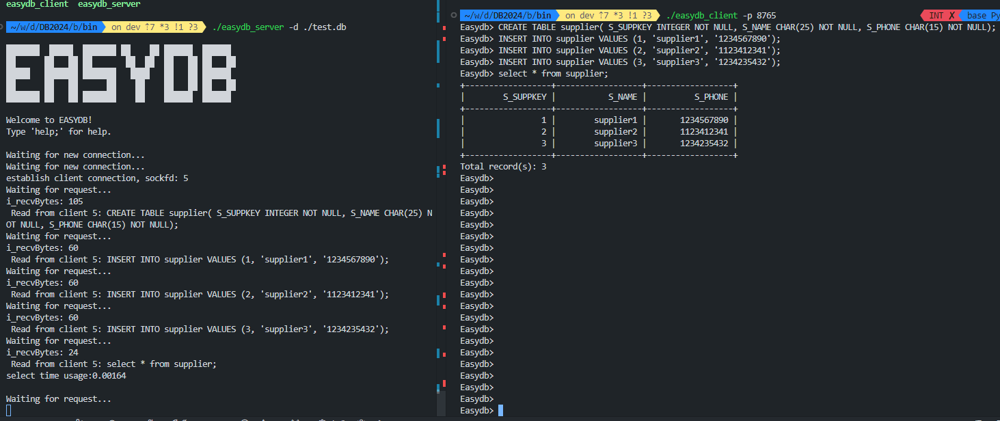
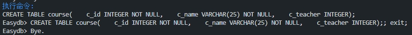
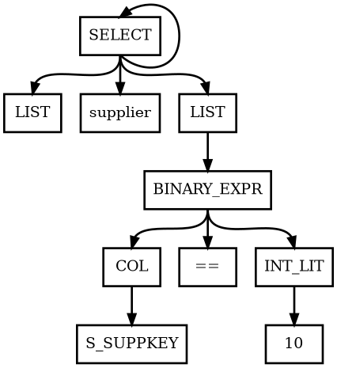
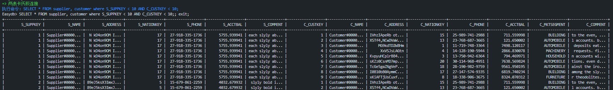

<h1 style="display: flex; justify-content: center">实验4：查询分析实验报告</h1>

[TOC]

# 1 实验分工安排

周强俊：SELECT语句的词法、语法、语义分析，报告撰写

唐雨馨：INSERT语句的词法、语法、语义分析，添加SELECT对ORDER BY的支持，报告撰写

周智淦：DELETE\DROP语句的词法、语法、语义分析，添加SELECT对UNIQUE的支持，报告撰写

字阳：CREATE语句的词法、语法、语义分析、语法、语义分析可视化、测试方案设计、报告撰写

# 2 系统环境

系统：Ubuntu-24.04

clang版本：18.1.3

glibc版本：2.39

cmake版本：3.28.3

# 3 实验设计与实现

## 3.1 词法分析

### 3.1.1 概述

词法分析（Lexical Analysis）是编译过程中的第一阶段，它的任务是将源代码（在这个实验中是SQL语言）分解成一系列的标记（tokens）或者词汇单元。这些标记是源代码中的最小有意义的片段，比如关键字、标识符、字面量（如数字、字符串）、运算符等。词法分析器通常使用有限状态自动机来识别这些标记，并忽略掉空格、换行等无关字符。这些信息后续会被交给语法分析模块处理，该阶段也是我们识别SQL语言的基础。

词法分析器的主要任务包括：
1. **扫描源代码**：逐字符读取源代码，并识别出构成语言的标记。
2. **生成标记流**：将识别出的标记以及它们的属性（如数值、类型等）输出为一个标记流。
3. **错误检测**：识别无法识别的字符序列，如拼写错误的关键字或非法的字符。

### 3.1.2 具体实现

该部分功能我们使用flex工具完成。Flex（Fast Lexical Analyzer Generator）是一个开源的词法分析器生成器，它可以根据用户提供的规则自动生成C语言代码，用于识别和处理文本中的词法单元（tokens）。Flex广泛应用于编译器设计、文本处理程序和其他需要词法分析的应用中。Flex读取一个定义了词法规则的文件（通常以`.l`为扩展名），这些规则使用正则表达式来描述。Flex将这些规则转换成一个有限状态自动机（finite state automaton），并生成一个C语言程序，该程序实现了这个自动机，能够识别和处理输入文本中的词法单元。

在本项目中，我们的词法分析在`src/parser/lex.l`中实现。具体来说，我们主要从中提取出关键词信息，我们的系统支持以下关键词：

1. `SHOW`：用于显示数据库中的表、索引或其他对象的信息。
2. `BEGIN`：开始一个事务块。
3. `COMMIT`：提交当前事务，并使所有更改永久生效。
4. `ABORT`：中止当前事务，不保存任何更改。
5. `ROLLBACK`：回滚当前事务，撤销所有更改。
6. `TABLES`：通常与 `SHOW` 一起使用，列出数据库中的所有表。
7. `CREATE`：用于创建新的数据库对象，如表、索引、视图等。
8. `TABLE`：与 `CREATE` 一起使用，创建新表。
9. `DROP`：用于删除数据库对象。
10. `DESC` 或 `DESCRIBE`：显示表的结构或列的信息。
11. `INSERT`：向表中插入新的行。
12. `INTO`：与 `INSERT` 一起使用，指定要插入数据的表。
13. `VALUES`：与 `INSERT` 一起使用，指定要插入的值。
14. `DELETE`：从表中删除行。
15. `FROM`：与 `DELETE` 或 `SELECT` 一起使用，指定要操作的表。
16. `WHERE`：与 `DELETE`、`SELECT` 或 `UPDATE` 一起使用，指定行的条件。
17. `UPDATE`：更新表中的现有行。
18. `SET`：与 `UPDATE` 一起使用，指定要更新的列和值。
19. `SELECT`：从表中检索数据。
20. `INT`：整数数据类型。
21. `INTEGER`：与 `INT` 相同，整数数据类型。
22. `CHAR`：固定长度的字符串数据类型。
23. `VARCHAR`：可变长度的字符串数据类型。
24. `FLOAT`：浮点数数据类型。
25. `DATETIME`：日期和时间数据类型。
26. `NOT NULL`：列不能包含 NULL 值的约束。
27. `UNIQUE`：列必须包含唯一的值。
28. `INDEX`：数据库中用于提高查询效率的索引。
29. `AND`：逻辑运算符，用于组合多个条件。
30. `JOIN`：用于结合两个或多个表的行。
31. `EXIT`：退出当前的交互式会话。
32. `HELP`：显示帮助信息。
33. `ORDER`：用于结果集的排序。
34. `BY`：与 `ORDER` 一起使用，指定排序的列。
35. `ASC`：指定升序排序。
36. `ENABLE_NESTLOOP`：启用嵌套循环连接。
37. `ENABLE_SORTMERGE`：启用排序合并连接。
38. `ENABLE_HASHJOIN`：启用哈希连接。
39. `AS`：为表或列指定别名。
40. `COUNT`：聚合函数，用于计算行数。
41. `MAX`：聚合函数，用于查找最大值。
42. `MIN`：聚合函数，用于查找最小值。
43. `SUM`：聚合函数，用于计算总和。
44. `GROUP`：与 `BY` 一起使用，用于分组数据。
45. `HAVING`：与 `GROUP BY` 一起使用，指定分组的条件。
46. `STATIC_CHECKPOINT`：用于数据库的静态检查点操作。
47. `LOAD`：加载数据到数据库。
48. `OUTPUT_FILE`：指定输出文件。
49. `IN`：子句，用于指定值是否在某个范围内。
50. `TRUE`：布尔值真。
51. `FALSE`：布尔值假。
52. `ON`：控制系统参数是否开启，ON表示打开
53. `OFF`：控制系统参数是否开启，OFF表示关闭 


这些 token 覆盖了 SQL 语言中的许多核心功能，包括数据定义、数据操作、事务控制、数据类型和聚合函数等。通过识别这些 token，词法分析器为 SQL 语句的解析提供了基础。


## 3.2 语法分析

### 3.2.1 概述

语法分析（Syntax Analysis）是编译过程的一个关键阶段，它发生在词法分析之后。在这个阶段，编译器检查源代码是否符合定义的语法规则。这些规则描述了编程语言中有效的语句结构，包括变量声明、控制流语句、表达式等。语法分析的主要目的是构建一个抽象的语法树（Abstract Syntax Tree, AST），这棵树表示了源代码的结构，并且可以用来进行后续的语义分析和代码生成。

语法分析器的主要任务包括：
1. **确认语法正确性**：验证输入的源代码是否符合语言的语法规则。
2. **构建语法树**：将输入的代码转换成一个层次结构，这个结构能够表示代码的逻辑和结构关系。
3. **错误检测和报告**：识别语法错误，并提供错误的位置和可能的修正建议。

### 3.2.2 语法分析与词法分析之间的关联

语法分析和词法分析是编译过程中紧密相关的两个阶段：

1. **顺序性**：词法分析通常在语法分析之前执行。语法分析器依赖于词法分析器提供的标记流作为输入。
2. **层次性**：词法分析关注的是源代码的表层结构，而语法分析关注的是源代码的深层结构。词法分析器识别出标记，而语法分析器则根据语言的语法规则将这些标记组合成更大的结构。
3. **错误处理**：虽然两个阶段都会进行错误检测，但它们的焦点不同。词法分析器检测字符层面的错误，而语法分析器检测结构层面的错误。
4. **互相依赖**：语法分析器需要词法分析器提供的准确标记流来正确地解析代码。如果词法分析器未能正确识别标记，或者漏掉了标记，语法分析器可能无法正确地构建语法树。

在实际的编译器实现中，这两个阶段通常是通过两个不同的工具来完成的：Lex/Flex 用于词法分析，而 Yacc/Bison 用于语法分析。这两个工具的输出（标记流和语法树）是编译器后续阶段如语义分析和代码生成的基础。

### 3.2.3 具体实现

在语法分析上，我们使用了Bison工具，下面是对这个工具的简单介绍：

**Yacc（Yet Another Compiler Compiler）**

Yacc 是一个在 Unix 和 Linux 系统中广泛使用的编译器编译器，用于生成语法分析器。 它允许开发者使用巴克斯范式（BNF）定义编程语言的语法规则，并根据这些规则生成一个能够识别和分析语言句子的语法分析器。 Yacc 主要处理上下文无关文法（context-free grammars），并生成一个能够识别符合这些文法的输入序列的程序。 它通常与 Lex 配合使用，其中 Lex 作为词法分析器，负责将输入的字符序列分割成一系列的标记（tokens），然后 Yacc 对这些标记进行语法分析。

**Bison（GNU版本的Yacc）**

Bison 是 Yacc 的 GNU 实现，它不仅与 Yacc 基本兼容，还增加了一些改进和新功能。 Bison 也是一个解析器生成器，它将带有注释的上下文无关语法转换成确定性 LR 或广义 LR (GLR) 解析器。 除了 Yacc 支持的 LALR 语法分析外，Bison 还增加了对 GLR 的支持，使其能够处理更广泛的语法类型。 Bison 同样与 Flex（Lex 的 GNU 实现）配合使用，用于生成完整的编译器或解释器。 它允许开发者定义语言的语法，并生成一个可用于解析该语言的解析器。 Bison 的使用可以显著简化编译器或解释器的开发工作。

**文法**

我们根据SQL的语法标准设计了以下的文法。使用该文法，我们能够实现最基本的DDL和DML语言。
以下文法描述的每一个非终结符，我们都按照了BNF范式进行整理，整理结果如下：

``` yacc
// 定义了 SQL 语句的起始符号，可以是一个完整的语句、设置输出语句、帮助命令、退出命令或文件结束符。
start:
    stmt ';'
    | setOutputStmt
    | HELP
    | EXIT
    | T_EOF
    ;

// 定义了 SQL 语句的种类，包括数据库操作语句、数据定义语句、数据操纵语句和事务语句。
stmt:
    dbStmt
    | ddl
    | dml
    | txnStmt
    | setStmt
    ;

// 定义了事务控制语句，包括开始事务、提交事务、中止事务和回滚事务。
txnStmt:
    TXN_BEGIN
    | TXN_COMMIT
    | TXN_ABORT
    | TXN_ROLLBACK
    ;

// 定义了数据库查询语句，包括显示所有表和显示表的索引。
dbStmt:
    SHOW TABLES
    | SHOW INDEX FROM tbName
    ;

// 定义了设置系统参数的语句。
setStmt:
    SET set_knob_type '=' VALUE_BOOL
    ;

// 定义了设置输出参数的语句。
setOutputStmt:
    SET set_knob_type VALUE_BOOL
    ;

// 定义了数据定义语句，包括创建表、删除表、描述表、创建索引、删除索引、创建静态检查点和加载数据。
ddl:
    CREATE TABLE tbName '(' fieldList ')'
    | DROP TABLE tbName
    | DESC tbName
    | CREATE INDEX tbName '(' colNameList ')'
    | DROP INDEX tbName '(' colNameList ')'
    | CREATE STATIC_CHECKPOINT
    | LOAD fileName INTO tbName
    ;

// 定义了数据操纵语句，包括插入数据、删除数据、更新数据和查询数据。
dml:
    INSERT INTO tbName VALUES '(' valueList ')'
    | DELETE FROM tbName optWhereClause
    | UPDATE tbName SET setClauses optWhereClause
    | SELECT UNIQUE selector FROM tableList optWhereClause group_by_clause_opt having_clause_opt opt_order_clause
    | SELECT selector FROM tableList optWhereClause group_by_clause_opt having_clause_opt opt_order_clause
    ;

// 定义了字段列表，可以是一个字段或由逗号分隔的字段列表。
fieldList:
    field
    | fieldList ',' field
    ;

// 定义了列名列表，可以是一个列名或由逗号分隔的列名列表。
colNameList:
    colName
    | colNameList ',' colName
    ;

// 定义了字段定义，包括列名和数据类型，可以指定字段为非空。
field:
    colName type
    | colName type NOT_NULL
    ;

// 定义了数据类型，包括整数、字符、可变字符、浮点数和日期时间。
type:
    INT
    | CHAR '(' VALUE_INT ')'
    | VARCHAR '(' VALUE_INT ')'
    | FLOAT
    | DATETIME
    ;

// 定义了值列表，可以是一个值或由逗号分隔的值列表。
valueList:
    value
    | valueList ',' value
    ;

// 定义了值的类型，包括整数、浮点数、字符串和布尔值。
value:
    VALUE_INT
    | VALUE_FLOAT
    | VALUE_STRING
    | VALUE_BOOL
    ;

// 定义了条件表达式，包括列和操作符以及表达式。
condition:
    col op expr
    | col op dml
    | col op '(' dml ')'
    | col op '(' valueList ')'
    ;

// 定义了可选的 WHERE 子句。
optWhereClause:
    ε
    | WHERE whereClause
    ;

// 定义了 WHERE 子句，可以是一个条件或由 AND 连接的条件列表。
whereClause:
    condition
    | whereClause AND condition
    ;

// 定义了列引用，可以是带表名的列名、聚合函数等。
col:
    tbName '.' colName
    | colName
    | COUNT '(' '*' ')' AS colName
    | COUNT '(' colName ')' AS colName
    | COUNT '(' '*' ')' AS COUNT
    | COUNT '(' colName ')' AS COUNT
    | MAX '(' colName ')' AS colName
    | MIN '(' colName ')' AS colName
    | SUM '(' colName ')' AS colName
    | COUNT '(' '*' ')'
    | COUNT '(' colName ')'
    | MAX '(' colName ')'
    | MIN '(' colName ')'
    | SUM '(' colName ')'
    ;

// 定义了列列表，可以是一个列或由逗号分隔的列列表。
colList:
    col
    | colList ',' col
    ;

// 定义了操作符，包括等于、小于、大于、不等于、小于等于、大于等于和 IN 操作符。
op:
    '=' { SV_OP_EQ }
    | '<' { SV_OP_LT }
    | '>' { SV_OP_GT }
    | NEQ { SV_OP_NE }
    | LEQ { SV_OP_LE }
    | GEQ { SV_OP_GE }
    | IN { SV_OP_IN }
    ;

// 定义了算术操作符，包括加、减、乘、除。
arith_op:
    '+' { SV_OP_PLUS }
    | '-' { SV_OP_MINUS }
    | '*' { SV_OP_MUL }
    | '/' { SV_OP_DIV }
    ;

// 定义了表达式，可以是一个值或一个列。
expr:
    value
    | col
    ;

// 定义了 SET 子句列表，可以是一个 SET 子句或由逗号分隔的 SET 子句列表。
setClauses:
    setClause
    | setClauses ',' setClause
    ;

// 定义了算术表达式，包括列名、算术操作符和值。
arithExpr:
    colName arith_op value
    ;

// 定义了 SET 子句，包括列名、等号和算术表达式或值。
setClause:
    colName '=' arithExpr
    | colName '=' value
    ;

// 定义了选择器，可以是星号（*）代表所有列或列列表。
selector:
    '*'
    | colList
    ;

// 定义了表列表，可以是一个表或由逗号分隔的表列表，支持 JOIN 操作。
tableList:
    tbName
    | tableList ',' tbName
    | tableList JOIN tbName
    ;

// 定义了可选的 GROUP BY 子句。
group_by_clause_opt:
    GROUP BY colList
    | ε
    ;

// 定义了可选的 HAVING 子句。
having_clause_opt:
    HAVING whereClause
    | ε
    ;

// 定义了可选的 ORDER BY 子句。
opt_order_clause:
    ORDER BY order_clause
    | ε
    ;

// 定义了ORDER BY 子句，可以根据哪一列进行排序
order_clause:
    col opt_asc_desc
    ;

// 定义了ORDER BY子句，可以顺序排还是逆序排
opt_asc_desc:
    ASC { OrderBy_ASC }
    | DESC { OrderBy_DESC }
    | { OrderBy_DEFAULT }
    ;

// 定义了设置系统参数的类型。
set_knob_type:
    ENABLE_NESTLOOP { EnableNestLoop }
    | ENABLE_SORTMERGE { EnableSortMerge }
    | ENABLE_HASHJOIN { EnableHashJoin }
    | OUTPUT_FILE { EnableOutput }
    ;

// 定义了表名、列名和文件名为标识符。
tbName: IDENTIFIER;

colName: IDENTIFIER;

fileName: PATH_STRING;
```

## 3.3 语义分析

### 3.3.1 概述

语义分析（Semantic Analysis）是编译过程的一个阶段，它紧随语法分析之后执行。在语法分析阶段，编译器构建了抽象语法树（AST），表示了源代码的结构。语义分析的任务是检查这些结构是否符合编程语言的语义规则，即它们是否有意义。

**语义分析的主要任务包括：**

1. **类型检查**：确保所有的表达式和变量都使用了正确的数据类型。例如，检查是否尝试将字符串与数字相加，或者是否正确地处理了类型转换。

2. **一致性检查**：确保所有的语句都是正确的，例如检查where后面是否有条件语句等。

3. **生成中间表示**：语义分析器通常会生成中间表示（Intermediate Representation, IR），这是一种低级的、与机器无关的代码表示，它用于后续的优化和代码生成。在本次实验中，该中间表示就是在系统运行时，存放在内存中的数据结构。

4. **错误检测和报告**：识别语义错误，并提供错误的位置和可能的修正建议。

**语义分析的重要性：**

1. **确保程序正确性**：语义分析确保程序的逻辑和结构符合语言规范，帮助开发者编写出更可靠的代码。
2. **提供反馈**：通过早期发现错误，语义分析可以减少调试时间和提高开发效率。
3. **支持优化**：中间表示（IR）是编译器优化的基础，语义分析的结果直接影响到优化的可能性和效果。
4. **代码生成**：语义分析的结果用于生成目标代码，确保生成的代码能够正确执行源代码的意图。

语义分析是编译过程中连接SQL源代码和最终执行代码的桥梁，它确保了代码的语义正确性，并为后续的代码优化和生成提供了基础。

### 3.3.2 具体实现

语义分析是和语法分析部分绑定的。具体来说，在语法分析部分，我们使用了Yacc来进行语法分析，当某一个语句被规约到对应的文法时会执行一个动作，我们就依靠这些嵌入的寓意动作代码来实现语义信息的分析和构建。例如，在算术表达式的解析中，如果匹配到的规则是加法操作（1 + 2），那么我们就可以执行`$$ = $1 + $3`，其中`$$`表示这个加法语句运行的结果，可以用来传递或计算从子表达式（规则右侧的部分）得到的值。

在本阶段我们是使用yacc提供的功能完成AST树的构建，在每一个规约的动作，我们都会为AST的节点赋予正确的语义。

在树的根节点处，我们将后面所有分析出的结果存储到`ast::parse_tree`中，这就是我们分析得到的AST树，该AST树将会用于后续的查询计划生成等。
下面的`parse_tree = $1;`就是将`stmt`所有的信息都赋值到`ast::parse_tree`。

```yacc
start:
    stmt ';'
    {
        parse_tree = $1;
        YYACCEPT;
    };
```

在树的中间节点，我们会从中提取出需要用的信息来构建AST，每一个中间节点会根据该语句的语义信息从中抽取出有用的语义信息进行组合然后返回，交给“上一层”的文法处理。以下面的`ddl = CREATE TABLE tbName '(' fieldList ')'`为例，这个文法对应的语义动作是`$$ = std::make_shared<CreateTable>($3, $5);`，它表示从`tbName`和`filedList`中取出语义信息（分别对应`$3`和`$5`），然后构造出一个`CreateTable`类型的节点，再赋值给`ddl`。

```yacc
ddl:
        CREATE TABLE tbName '(' fieldList ')'
    {
        $$ = std::make_shared<CreateTable>($3, $5);
    }
    |   DROP TABLE tbName
    {
        $$ = std::make_shared<DropTable>($3);
    }
    |   DESC tbName
    {
        $$ = std::make_shared<DescTable>($2);
    }
    |   CREATE INDEX tbName '(' colNameList ')'
    {
        $$ = std::make_shared<CreateIndex>($3, $5);
    }
    |   DROP INDEX tbName '(' colNameList ')'
    {
        $$ = std::make_shared<DropIndex>($3, $5);
    }
    |   CREATE STATIC_CHECKPOINT
    {
        $$ = std::make_shared<CreateStaticCheckpoint>();
    }
    |   LOAD fileName INTO tbName
    {
        $$ = std::make_shared<LoadData>($2, $4);
    }
    ;
```

上面的`CreateTable`节点的定义如下所示。该结构体需要我们传入两个参数：`tab_name_`表名称和`fields_`字段列表

```cpp
struct CreateTable : public TreeNode {
  std::string tab_name;
  std::vector<std::shared_ptr<Field>> fields;

  CreateTable(std::string tab_name_, std::vector<std::shared_ptr<Field>> fields_)
      : tab_name(std::move(tab_name_)), fields(std::move(fields_)) {}
};
```

对于叶子节点，我们就简单地将给符号的语义信息返回给上一层。例如，`arith_op`表示算数运算符，当我们匹配到`+`，我们就执行语义动作`$$ = SV_OP_PLUS;`，返回`SV_OP_PLUS`，其中`SV_OP_PLUS`是枚举类型`enum SvArithOp`中的一项。

```yacc
arith_op:
        '+'
    {
        $$ = SV_OP_PLUS;
    }
    |   '-'
    {
        $$ = SV_OP_MINUS;
    }
    |   '*'
    {
        $$ = SV_OP_MUL;
    }
    |   '/'
    {
        $$ = SV_OP_DIV;
    }
    ;
```

通过以上方式，我们就能成功构建AST树，通过对AST树的分析，我们便能够在查询计划生成阶段生成正确的，符合语义的查询计划。


## 3.4 AST分析、查询计划生成与执行

以下是服务端的代码（`src/easydb.cpp`），其中包含了AST分析、查询计划生成和执行的整个流程，后续我们就以该代码作为线索进行分析。

```cpp
if (yyparse() == 0 && ast::parse_tree != nullptr) {
    // analyze and rewrite
    std::shared_ptr<Query> query = analyze->do_analyze(ast::parse_tree);
    yy_delete_buffer(buf);
    finish_analyze = true;
    pthread_mutex_unlock(buffer_mutex);
    // 生成查询计划
    std::shared_ptr<Plan> plan = optimizer->plan_query(query, context);
    // portal，通过系统的`入口`执行对应的查询计划
    std::shared_ptr<PortalStmt> portalStmt = portal->start(plan, context);
    portal->run(portalStmt, ql_manager.get(), &txn_id, context);
    portal->drop();
}
```

### 3.4.1 AST分析

在服务端代码中，每次我们接收到一个来自客户端的SQL语句时，我们都会先调用yacc提供的接口`yyparse()`函数对SQL的词法、语法、语义进行解析，构建AST树，构建的AST树存储在变量`ast::parse_tree`中。接着会执行以下代码，将AST树传给`analyse`模块进行分析。

```cpp
std::shared_ptr<Query> query = analyze->do_analyze(ast::parse_tree);
```

`do_analyse()`函数主要任务是对AST树进行分析，最后返回分析结果`query`。以DML语句为例，他会对AST树进行解析，然后DML语句的AST树转化为一个`Query`类型，`Query`的定义如下，它描述了一个DML语句的全部语义信息，包括：where条件、投影列、表名、update的set值、insert的values值、group by条件、having条件。`Query`类提供了更加全面且高层测的信息，方便我们在后续计划生成时候使用。

```cpp
class Query {
 public:
  std::shared_ptr<ast::TreeNode> parse;
  // where条件
  std::vector<Condition> conds;
  // 投影列
  std::vector<TabCol> cols;
  // 表名
  std::vector<std::string> tables;
  // update 的set 值
  std::vector<SetClause> set_clauses;
  // insert 的values值
  std::vector<Value> values;
  // group by条件
  std::vector<TabCol> groupby_cols;
  // having条件
  std::vector<Condition> having_conds;
};
```

### 3.4.2 查询计划生成

对于上一步分析的结果`query`，我们将会基于它生成查询计划。这里，我们执行以下代码来生成查询计划。

```cpp
std::shared_ptr<Plan> plan = optimizer->plan_query(query, context);
```

其中`plan_query()`函数的作用是根据上一部的分析结果，匹配对应的处理逻辑，生成查询计划。
以DML语句为例，在`plan_query()`中，最后要将结果存储到`DMLPlan`类中，这里面对`query`中的信息进行了进一步的解析和整理，更方便后续执行。

```cpp
class DMLPlan : public Plan {
 public:
  // 子计划
  std::shared_ptr<Plan> subplan_;
  // 表名称
  std::string tab_name_;
  // 值列表
  std::vector<Value> values_;
  // 条件列表
  std::vector<Condition> conds_;
  // 子句
  std::vector<SetClause> set_clauses_;
  bool unique_;  // unique select
};
```

### 3.4.3 查询计划的执行

上一步生成的查询计划会被传给`portal`执行。`portal`相当于是系统的入口，里面集成了很多executor，例如`executor_sort`、`executor_nestloop`、`executor_merge_join`、`executor_hash_join`、`executor_insert`、`executor_projection`等，它会根据查询计划的类型决定最后使用什么executor来进行执行。

```cpp
std::shared_ptr<PortalStmt> portalStmt = portal->start(plan, context);
portal->run(portalStmt, ql_manager.get(), &txn_id, context);
portal->drop();
```

## 3.5 AST可视化

AST是一个树形结构，因此我们对AST进行树遍历，在遍历的过程中生成dot文件。相关的代码被编写成了一个模块，放在文件`src/include/parser/ast_dot_printer.h`中。

```cpp
class TreeDotPrinter {
 public:
  std::ofstream *outfile = nullptr;
  TreeDotPrinter(std::string _file_name);
  void print(const std::shared_ptr<TreeNode> &node);
 private:
  void print_node(const std::shared_ptr<TreeNode> &node, int parent);
}
```
以上代码是`ast_dot_printer.h`的片段，其中的`TreeDotPrinter()`、`print()`、`print_node()`是该类中最重要的三个函数。
- `TreeDotPrinter()`：`TreeDotPrinter`类初始化的时候需要传入`std::string`类型的参数，表示dot文件输出的文件路径。传入的字符串会被用于创建文件输出流(`ofstream`)，并初始化成员变量`outfile`。
- `print()`：该函数需要传入AST树的根节点，该函数首先会声明一个名为ast的图，然后规定图中的节点和边的样式。该函数会调用`print_node()`函数。
  
  ```cpp
  void print(const std::shared_ptr<TreeNode> &node) {
    *outfile << "digraph ast{" << std::endl;
    *outfile << "node[shape=record, style=bold];" << std::endl;
    *outfile << "edge[style=bold];" << std::endl;
    print_node(node, 0);
    *outfile << "}" << std::endl;
  }
  ```
- `print_node()`：该函数接收两个参数，第一个参数是AST树的一个节点，第二个参数是父节点的id。该函数会判断当前传入的节点类型，然后根据类型进行相应的处理。下面的代码是`IntLit`类型和`ArithExpr`类型的处理逻辑。
  
    如果是`IntLit`类型，那就说明，当前的节点是一个int类型的数字，所以我们先调用函数`alloc_node()`分配一个dot节点，指定该节点的类型为`IntLit`，分配操作会自动为节点分配一个id并返回。下一步就是将该节点连接到已有的树中。这里我们通过调用`print_edge()`函数完成，该函数会在`_node_id`指向的节点和`parent`指向的节点之间创建一个箭头，表示父子关系。所以这里我们就将新分配的dot节点和其父节点之间创建了一个后者指向前者的箭头。最后就是将int的值放到树中，这里我们通过`print_val()`函数实现。该函数会创建一个节点，不过节点的label是对应的值。

    如果是`ArithExpr`类型，之前分配`ArithExpr`节点和连接的操作与上类似，不同的是类型的右值可能是一个子树，所以我们还需要继续遍历它的子树。所以我们就递归调用`print_node()`函数，传入的节点是右子树的根节点`x->rhs`。

    ```cpp
    void print_node(const std::shared_ptr<TreeNode> &node, int parent) {
        if (auto x = std::dynamic_pointer_cast<IntLit>(node)) {
            int _node_id = alloc_node("INT_LIT");
            print_edge(_node_id, parent);
            print_val(x->val, _node_id);
        }else if (auto x = std::dynamic_pointer_cast<ArithExpr>(node)) {
            int _node_id = alloc_node("Arith_EXPR");
            print_edge(_node_id, parent);
            print_val(x->lhs, _node_id);
            print_val(arith_op2str(x->op), _node_id);
            print_node(x->rhs, _node_id);
        }
        ......
    }
    ```

通过以上方式，我们便可以递归地构建AST树的dot表示，在构建好了之后，只需要调用dot命令便可将dot文件转化成svg。

```bash
dot -T svg ast.dot -o ast.svg
```

## 3.6 C/S架构搭建

我们的DBMS使用了传统的C/S架构，数据库服务端一直运行在后台，需要使用时，就开启一个客户端使用Socket进行连接通信。每当用户在客户端输入命令并发送后，服务端会接受到命令，并对SQL语句进行解析，执行对应的操作，然后将结果再通过Socket通信返回给客户端。

接下来，我们将会对服务端和客户端分别进行介绍：

### 3.6.1 服务端

我们的服务端实现代码存放在`src/easydb.cpp`。服务端的主要任务如下：

- 资源初始化
- 端口绑定和监听
- 建立与客户端的连接
- 处理客户端发送的SQL指令
- 释放资源

下面，我们结合代码，依次对这些任务进行阐述。

1. 资源初始化
   
    在服务端启动阶段，我们会对一些关键的资源进行初始化，
    包括：存储管理、缓冲区管理、索引管理、并发控制、事务管理、查询计划生成器、
    查询优化器、AST分析器等资源的初始化。这些资源将在后续完成DBMS功能起到至关重要的作用。

2. 端口绑定和监听
   
    接下来服务端会调用Socket提供的API对用户指定的端口进行绑定操作，
    并监听该端口是否有客户端连接。

    这里我们使用到Socket模块提供的`socket()`、`setsockopt()`等函数创建socket。然后使用`bind()`函数对指定端口进行绑定，接着用`listen()`对指定端口进行监听，并在`accept()`函数处阻塞，只有新的客户端连接到来的时候才会继续。

    ```cpp
    sockfd_server = socket(AF_INET, SOCK_STREAM, 0);  // ipv4,TCP
    setsockopt(sockfd_server, SOL_SOCKET, SO_REUSEADDR, &val, sizeof(val));
    s_addr_in.sin_family = AF_INET;
    s_addr_in.sin_addr.s_addr = htonl(INADDR_ANY);
    s_addr_in.sin_port = htons(SOCK_PORT);
    fd_temp = bind(sockfd_server, (struct sockaddr *)(&s_addr_in), sizeof(s_addr_in));
    fd_temp = listen(sockfd_server, MAX_CONN_LIMIT);
    while(1){
        std::cout << "Waiting for new connection..." << std::endl;
        pthread_t thread_id;
        struct sockaddr_in s_addr_client {};
        int client_length = sizeof(s_addr_client);
        // 在服务端接收到一个新的连接之前，一直阻塞在这里。
        pthread_mutex_lock(sockfd_mutex);
        sockfd = accept(sockfd_server, (struct sockaddr *)(&s_addr_client), (socklen_t *)(&client_length));
        // 和客户端建立连接，并开启一个线程负责处理客户端请求
        if (pthread_create(&thread_id, nullptr, &client_handler, (void *)(&sockfd)) != 0) {
            std::cout << "Create thread fail!" << std::endl;
            break;  
        }
    }
    ```

3. 建立与客户端的连接
   
    当服务端接收到客户端的连接请求之后，客户端会使用`pthread_create()`开启一个线程，该线程会处理来自客户端的所有请求。

    ```cpp
    // 和客户端建立连接，并开启一个线程负责处理客户端请求
    if (pthread_create(&thread_id, nullptr, &client_handler, (void *)(&sockfd)) != 0) {
        std::cout << "Create thread fail!" << std::endl;
        break;  
    }
    ```

4. 处理客户端发送的SQL指令
   
    每当客户端传来一个SQL语句时，服务端就会有相应的处理逻辑来解析执行，并将执行后的结果通过socket传输给客户端。
    该部分代码已经在之前的部分有介绍，故此处不重复介绍。

    ```cpp
    if (yyparse() == 0 && ast::parse_tree != nullptr) {
        // analyze and rewrite
        std::shared_ptr<Query> query = analyze->do_analyze(ast::parse_tree);
        // 生成查询计划
        std::shared_ptr<Plan> plan = optimizer->plan_query(query, context);
        // portal，通过系统的`入口`执行对应的查询计划
        std::shared_ptr<PortalStmt> portalStmt = portal->start(plan, context);
        portal->run(portalStmt, ql_manager.get(), &txn_id, context);
        portal->drop();
    }
    ```

5. 释放资源
   
    服务端注册了一个回调函数，当用户按下Ctrl+C时会执行该函数，该函数会降should_exit置为true，然后服务端就会结束监听，接着调用`sm_manager->CloseDB()`关闭数据库，释放占用的资源。

    ```cpp
    void sigint_handler(int signo) {
        should_exit = true;
        log_manager->flush_log_to_disk();
        std::cout << "The Server receive Crtl+C, will been closed\n";
        longjmp(jmpbuf, 1);
    }
    ```

### 3.6.2 客户端

客户端的作用就是提供一个命令行界面，能够让用户与服务端进行交互。具体来说，在用户开启客户端之后，客户端会使用socket与服务端连接通信，接着就会展示命令行界面。每当用户输入一个SQL语句并按下回车时，客户端就会从stdin中读入用户输入的数据，将其传输到服务端，然后阻塞等待服务端的返回结果，最后再打印到命令行中。


# 4 使用手册

## 4.1 编译

```shell
# 先进入到项目目录
cd /path/to/easydb

# 新建build目录并进入
mkdir build
cd build

# 使用cmake编译项目
cmake ..
make -j
```

## 4.2 运行

```shell
# 进入到build/bin/目录下
cd build/bin/

# 启动服务端
./easydb_server -d test.db -p 8765

# 启动客户端
./easydb_client -p 8765

# 在客户段中输入help;可以查看帮助信息
# 在客户端中执行SQL语句即可查看到执行的结果，如：
SELECT * FROM supplier WHERE S_NAME = 'Supplier#000000003';
```



## 4.3 AST可视化

```shell
# 进入到build/test目录下
cd build/test/

# 运行parser_ast_printer
./parser_ast_printer -s "SELECT * FROM supplier;" -o ast.dot

# 使用dot可视化
dot -T svg ast.dot -o ast.svg
```

我们运行parser_ast_printer来打印出SQL语句的AST树对应的dot描述，然后再使用dot命令将dot文件转化成svg就可以使用浏览器查看。

# 5 测试方案与结果

## 5.1 测试设计与实现

我们使用SQL语句进行测试，为了能够更方便地进行测试，我们编写了一个测试脚本，该脚本可以自动启动服务端和和客户端，导入测试数据，并执行SQL语句，然后输出结果。该脚本放在根目录下的`test/parser/parser_test.sh`。

### 5.1.1 服务端的启动和关闭

我们的数据库系统是C/S架构的，因此每次在执行SQL语句之前，需要将服务端启动。这里我们使用bash脚本进行启动，将stdout和stderr都重定向到日志文件中，以便后续查看。我们的服务端是在后台运行的，因此需要等待一段时间，以便服务端启动完成。这里我们使用sleep函数等待一段时间，然后检查服务端是否已经启动完成。

```shell
# 首先启动server
print_green "启动server"
$SERVER_PATH -d $DB_PATH -p $SERVE_PORT > $SERVER_LOG_PATH 2>&1  &
sleep 10
```

在我们完成测试的所有操作之后，运行在后台的服务端也需要关闭，这里我们使用kill命令关闭服务端进程。

```shell
clean_up(){
    # print_red "执行清理操作"
    ps -aux | grep easydb | grep $(whoami) | awk '{print $2}' | xargs kill -9 > /dev/null 2>&1
}
# 退出时调用clean_up函数关闭Server进程
trap clean_up EXIT;
```

### 5.1.2 SQL语句的执行

为了能够优雅地在脚本中执行SQL语句，我们将执行SQL语句的命令封装成了一个函数，该函数接受一个参数，即SQL语句。然后我们会启动一个客户端连接到服务端，执行了该SQL语句后关闭该客户端。具体来说，我们使用了execute函数实现该功能。我们将语句从管道中传入到客户端的stdin中，执行完毕后，客户端会自动退出。

```shell
execute(){
    print_blue "执行命令: $1"
    echo "$1; exit;" | $CLIENT_PATH -p $SERVE_PORT
}
```

### 5.1.3 测试数据的导入

我们的数据库实现了load命令，该命令能够从文件中读取并导入数据到数据库中。所以，我们可以使用以下的shell命令将测试数据导入到数据库中。

```shell
execute "load $DATA_SUPPLIER_PATH into supplier;"
```

### 5.1.4 AST可视化

我们使用脚本运行写好的`parser_ast_printer`来完成该任务，具体来说，我们实现了`draw_ast()`函数来完成该功能。
该函数会将SQL语句字符串，通过调用`parser_ast_printer`转化为dot文件，最后再调用`dot`命令将dot文件转换为png文件。

```shell
draw_ast(){
    DOT_OUT_PATH=$DOT_ROOT/SQL$SQL_DOT_NUM.dot
    SVG_OUT_PATH=$DOT_ROOT/SQL$SQL_DOT_NUM.png
    SQL_DOT_NUM=$((SQL_DOT_NUM + 1))
    echo "$1"
    $ROOT_PATH/build/test/parser_ast_printer -s "$1" -o $DOT_OUT_PATH 
    dot -T png $DOT_OUT_PATH -o $SVG_OUT_PATH 
}
```

### 5.1.5 小数据集测试点设置

为了能够更加全面地测试我们的数据库系统，我们需要设置一些测试点。为了方便验证增删改查的正确性，我们在小数据集上设计了以下测试点。

1. Create Table相关测试

    这部分主要测试create语句的解析和执行情况，测试的表格中有INT，CHAR，DATETIME类型的字段。
    这里我们新建3个表格。student表、teacher表、course表和sc表。他们分别表示学生表、教室表、课程表和学生选课表。

    ```shell
    create_table_student=$(cat <<EOF
    CREATE TABLE student(\
        s_id INTEGER NOT NULL,\
        s_name VARCHAR(25) NOT NULL,\
        s_age INTEGER NOT NULL,\
        s_birthday DATETIME\
    );
    EOF
    )
    execute "$create_table_student"

    create_table_teacher=$(cat <<EOF
    CREATE TABLE teacher(\
        t_id INTEGER NOT NULL,\
        t_name VARCHAR(25) NOT NULL,\
        t_age INTEGER NOT NULL,\
        t_birthday DATETIME\
    );
    EOF
    )
    execute "$create_table_teacher"

    create_table_course=$(cat <<EOF
    CREATE TABLE course(\
        c_id INTEGER NOT NULL,\
        c_name VARCHAR(25) NOT NULL,\
        c_teacher INTEGER\
    );
    EOF
    )
    execute "$create_table_course"

    create_table_student_course=$(cat <<EOF
    CREATE TABLE sc(\
        sc_sid INTEGER NOT NULL,\
        sc_cid INTEGER NOT NULL\
    );
    EOF
    )
    execute "$create_table_student_course"
    ```

2. Insert相关测试

    这部分主要是测试Insert语句的解析和执行。我们会向之前定义的表中添加数据，所以我们设计了如下测试点：

    ```shell
    print_green "=> Insert"
    
    execute "INSERT INTO student values(5, 'aaa', 21, '1996-01-23');"
    execute "INSERT INTO student values(1, 'bbb', 25, '2001-02-03');"
    execute "INSERT INTO student values(4, 'ccc', 30, '2002-01-23');"
    execute "INSERT INTO student values(2, 'ddd', 22, '1994-08-12');"
    execute "INSERT INTO student values(3, 'eee', 35, '2000-01-23');"
    execute "INSERT INTO student values(3, 'eee', 35, '2000-01-23');"
    execute "INSERT INTO student values(6, 'fff', 35, '1999-01-23');"
    
    execute "INSERT INTO teacher values(1, 'aaa', 35, '1999-01-23');"
    execute "INSERT INTO teacher values(2, 'ddd', 49, '1979-01-23');"
    execute "INSERT INTO teacher values(3, 'bbb', 50, '1959-01-23');"
    execute "INSERT INTO teacher values(4, 'ccc', 33, '1993-01-23');"
    
    execute "INSERT INTO course values(1, 'math', 1);"
    execute "INSERT INTO course values(2, 'english', 2);"
    execute "INSERT INTO course values(3, 'dbms', 3);"
    
    execute "INSERT INTO sc values(1, 1);"
    execute "INSERT INTO sc values(2, 1);"
    execute "INSERT INTO sc values(3, 1);"
    execute "INSERT INTO sc values(4, 1);"
    execute "INSERT INTO sc values(5, 1);"
    execute "INSERT INTO sc values(1, 2);"
    execute "INSERT INTO sc values(3, 2);"
    execute "INSERT INTO sc values(5, 2);"
    execute "INSERT INTO sc values(2, 3);"
    execute "INSERT INTO sc values(4, 3);"
    execute "INSERT INTO sc values(5, 3);"
    execute "INSERT INTO sc values(6, 3);"
    ```


3. Select相关测试

    这部分主要是测试select语句的解析和执行情况，包括简单查询，带条件的查询，带order by的查询和带unique的查询。主要有以下几个测试点：

    ```shell
    print_green "=> Select"

    # 测试SELECT语句基本用法
    execute "SELECT * FROM student;"

    print_green "==> order"
    # 测试SELECT语句带order by操作
    execute "SELECT * FROM student order by s_age;"

    print_green "==> unique"
    # 测试SELECT语句带unique操作
    execute "SELECT UNIQUE * FROM student;"

    print_green "==> condition"
    # 测试SELECT语句带条件
    execute "SELECT * FROM student where s_age = 35;"

    print_green "===> condition order"
    # 测试SELECT语句带条件和order by
    execute "SELECT * FROM student where s_age = 35 order by s_birthday;"

    print_green "===> condition unique"
    # 测试SELECT语句带条件和unique
    execute "SELECT UNIQUE * FROM student where s_age = 35;"
    ```

4. Delete相关测试

    这部分主要是测试Delete语句的解析和执行，不失其一般性，我们设计一个测试点即可。
    这里我们选择删除表student中的s_id为6的学生，后面的select语句是检验delete语句是否实现其功能。

    ```shell
    print_green "=> Delete"
    execute "delete from student where s_id = 6;"
    execute "select * from student;"
    ```

5. Drop相关测试
   
    这部分主要是测试Drop语句的解析和执行，不失其一般性，我们设计一个测试点即可。
    这里我们选择删除表`studen`t和`teacher`。

    ```shell
    print_green "=> Drop Table"
    execute "show tables;"
    execute "drop table student;"
    execute "drop table teacher;"
    execute "show tables;"
    ```

6. 语法错误提示相关测试

    这部分主要是测试当用户输入了一个语法错误的SQL语句时，我们的系统能否提示语法错误。
    这里我们设计了以下两个测试点：

    ```shell 
    print_green "=> syntax error"
    execute "select * from student where s_id = ;"
    execute "insert student values() ;"
    ```

### 5.1.6 大数据集测试点设置

为了对我们数据库的进行更加全面的测试，我们使用了TPC-H数据集进行测试，测试的内容主要是创建表格、创建索引、Select、Join等。
我们设置了以下几个测试点：


1. Create Table相关测试

    这部分主要测试create语句的解析和执行情况，测试的表格中有INT，CHAR，DATETIME类型的字段。

    ```shell
    create_table_nation=$(cat <<EOF
    CREATE TABLE nation(\
        N_NATIONKEY INTEGER NOT NULL,\
        N_NAME CHAR(25) NOT NULL,\
        N_REGIONKEY INTEGER NOT NULL,\
        N_COMMENT VARCHAR(152)\
    );
    EOF
    )
    execute "$create_table_nation"

    create_table_region=$(cat <<EOF
    CREATE TABLE region(\
        R_REGIONKEY INTEGER NOT NULL,\
        R_NAME CHAR(25) NOT NULL,\
        R_COMMENT VARCHAR(152)\
    );
    EOF
    )

    execute "$create_table_region"

    create_table_part=$(cat <<EOF
    CREATE TABLE part(\
        P_PARTKEY INTEGER NOT NULL,\
        P_NAME VARCHAR(55) NOT NULL,\
        P_MFGR CHAR(25) NOT NULL,\
        P_BRAND CHAR(10) NOT NULL,\
        P_TYPE VARCHAR(25) NOT NULL,\
        P_SIZE INTEGER NOT NULL,\
        P_CONTAINER CHAR(10) NOT NULL,\
        P_RETAILPRICE FLOAT NOT NULL,\
        P_COMMENT VARCHAR(23) NOT NULL\
    );
    EOF
    )
    execute "$create_table_part"

    create_table_supplier=$(cat <<EOF
    CREATE TABLE supplier(\
        S_SUPPKEY INTEGER NOT NULL,\
        S_NAME CHAR(25) NOT NULL,\
        S_ADDRESS VARCHAR(40) NOT NULL,\
        S_NATIONKEY INTEGER NOT NULL,\
        S_PHONE CHAR(15) NOT NULL,\
        S_ACCTBAL FLOAT NOT NULL,\
        S_COMMENT VARCHAR(101) NOT NULL\
    );
    EOF
    )
    execute "$create_table_supplier"

    create_table_customer=$(cat <<EOF
    CREATE TABLE customer(\
        C_CUSTKEY INTEGER NOT NULL,\
        C_NAME VARCHAR(25) NOT NULL,\
        C_ADDRESS VARCHAR(40) NOT NULL,\
        C_NATIONKEY INTEGER NOT NULL,\
        C_PHONE CHAR(15) NOT NULL,\
        C_ACCTBAL FLOAT NOT NULL,\
        C_MKTSEGMENT CHAR(10) NOT NULL,\
        C_COMMENT VARCHAR(117) NOT NULL\
    );
    EOF
    )

    execute "$create_table_customer"

    create_table_orders=$(cat <<EOF
    CREATE TABLE orders(\
        O_ORDERKEY INTEGER NOT NULL,\
        O_CUSTKEY INTEGER NOT NULL,\
        O_ORDERSTATUS CHAR(1) NOT NULL,\
        O_TOTALPRICE FLOAT NOT NULL,\
        O_ORDERDATE DATETIME NOT NULL,\
        O_ORDERPRIORITY CHAR(15) NOT NULL,\
        O_CLERK CHAR(15) NOT NULL,\
        O_SHIPPRIORITY INTEGER NOT NULL,\
        O_COMMENT VARCHAR(79) NOT NULL\
    );
    EOF
    )
    execute "$create_table_orders"

    create_table_lineitem=$(cat <<EOF
    CREATE TABLE lineitem(\
        L_ORDERKEY INTEGER NOT NULL,\
        L_PARTKEY INTEGER NOT NULL,\
        L_SUPPKEY INTEGER NOT NULL,\
        L_LINENUMBER INTEGER NOT NULL,\
        L_QUANTITY FLOAT NOT NULL,\
        L_EXTENDEDPRICE FLOAT NOT NULL,\
        L_DISCOUNT FLOAT NOT NULL,\
        L_TAX FLOAT NOT NULL,\
        L_RETURNFLAG CHAR(1) NOT NULL,\
        L_LINESTATUS CHAR(1) NOT NULL,\
        L_SHIPDATE DATETIME NOT NULL,\
        L_COMMITDATE DATETIME NOT NULL,\
        L_RECEIPTDATE DATETIME NOT NULL,\
        L_SHIPINSTRUCT CHAR(25) NOT NULL,\
        L_SHIPMODE CHAR(10) NOT NULL,\
        L_COMMENT VARCHAR(44) NOT NULL\
    );
    EOF
    )
    execute "$create_table_lineitem"
    ```

2. Select相关测试

    这部分主要测试select语句的解析和执行情况，测试涉及到等值，不等值，复杂条件的查询。
    设计的测试点如下：

    ```shell
    print_green "-------- Select Test --------"
    execute "SELECT * FROM supplier where S_SUPPKEY = 10;"
    execute "SELECT * FROM supplier where S_SUPPKEY > 10 AND S_SUPPKEY < 20;"
    ```

3. Join相关测试

    这部分主要测试Join语句的解析和执行情况，测试涉及到等值，不等值，多表连接。
    设计的测试点如下：

    ```shell
    print_green "=> 单条件等值连接"
    print_green "==> 单条件等值连接"

    execute "SELECT * FROM supplier, nation where S_SUPPKEY < 10 AND S_NATIONKEY = N_NATIONKEY;"

    print_green "=> 单条件不等值连接"
    execute "SELECT * FROM supplier, customer where S_SUPPKEY < 100 AND C_CUSTKEY < 100 AND S_PHONE != C_PHONE;"

    print_green "=> 多条件连接"
    print_green "==> int, varchar上进行多条件连接"
    execute "SELECT * FROM supplier, customer where S_SUPPKEY < 10 AND C_CUSTKEY < 10 AND S_PHONE != C_PHONE AND S_SUPPKEY != C_CUSTKEY;"

    print_green "=> 三表连接"
    execute "SELECT S_NAME, C_NAME, N_NAME FROM supplier, customer, nation where S_SUPPKEY < 10 AND C_CUSTKEY < 10 AND S_NATIONKEY = N_NATIONKEY AND C_NATIONKEY = N_NATIONKEY;"

    print_green "=> 两表卡氏积连接"
    execute "SELECT * FROM supplier, customer where S_SUPPKEY < 10 AND C_CUSTKEY < 10;"
    ```

## 5.2 小数据集结果展示

### 5.2.1 初始化数据库

1. 服务端启动


### 5.2.2 Create Table相关测试

1. student表
   
- SQL：
    ```sql
    CREATE TABLE student(
        s_id INTEGER NOT NULL,
        s_name VARCHAR(25) NOT NULL,
        s_age INTEGER NOT NULL,
        s_birthday DATETIME
    );
    ```
- AST：
  
    

- 结果：

    

2. teacher表
   
- SQL：
    ```sql
    CREATE TABLE teacher(
        t_id INTEGER NOT NULL,
        t_name VARCHAR(25) NOT NULL,
        t_age INTEGER NOT NULL,
        t_birthday DATETIME
    );
    ```
- AST：
  
    

- 结果：

    


3. course表
   
- SQL：
    ```sql
    CREATE TABLE course(
        c_id INTEGER NOT NULL,
        c_name VARCHAR(25) NOT NULL,
        c_teacher INTEGER
    );
   ```
- AST：
  
    

- 结果：

    

4. sc表
   
- SQL：
    ```sql
    CREATE TABLE sc(
        sc_sid INTEGER NOT NULL,
        sc_cid INTEGER NOT NULL
    );
    ```
- AST：
  
    

- 结果：

    


### 5.2.3 Insert相关测试

Insert语句的AST相似度比较高，因此我们只展示向`student`表插入记录的例子。

- SQL：
    ```sql
    INSERT INTO student values(5, 'aaa', 21, '1996-01-23');
    ```
- AST：
  
    

- 结果：

    

### 5.2.4 Select相关测试

1. **基础用法**
- SQL：
    ```sql
    SELECT s_id, s_name, s_age, s_birthday FROM student;
    ```
- AST：
  
    

- 结果：

    

2. **带ORDER BY操作**
- SQL：
    ```sql
    SELECT s_id, s_name, s_age, s_birthday FROM student order by s_age;
    ```
- AST：
  
    

- 结果：

    


3. **带UNIQUE操作**
- SQL：
    ```sql
    SELECT UNIQUE s_id, s_name, s_age, s_birthday FROM student;
    ```
- AST：
  
    

- 结果：

    

    可以看到，其中的重复项(3, 'eee', 35, '2000-01-23')只剩下了一项

4. **带条件**
- SQL：
    ```sql
    SELECT s_id, s_name, s_age, s_birthday FROM student WHERE s_age = 35;
    ```
- AST：
  
    

- 结果：

    

5. **带条件和ORDER BY**
- SQL：
    ```sql
    SELECT s_id, s_name, s_age, s_birthday FROM student WHERE s_age = 35 ORDER BY s_birthday;
    ```
- AST：
  
    

- 结果：

    

6. **带条件和UNIQUE**
- SQL：
    ```sql
    SELECT UNIQUE s_id, s_name, s_age, s_birthday FROM student WHERE s_age = 35;
    ```
- AST：
  
    

- 结果：

    

7. **带JOIN**
- SQL：
    ```sql
    SELECT s_id, s_name, s_age, s_birthday, c_name FROM student, course, sc WHERE s_id = sc_sid AND c_id = sc_cid;
    ```
- AST：
  
    

- 结果：

    


### 5.2.5 Delete相关测试

Delete语句的AST相似度比较高，因此我们只展示删除`student`表中`s_id`为6的记录的例子。

- SQL：
    ```sql
    DELETE FROM student WHERE s_id = 6;
    ```
- AST：
  
    

- 结果：

    

    可以看到，在我们执行`delete`操作之前，`student`表中是有`s_id`为6的记录的，但是在删除了之后，`student`表中就查询不到`s_id`为6的记录了。

### 5.2.6 Drop相关测试

DROP用于删除一个表，这里我们以删除`student`和`teacher`为例

- SQL：
    ```sql
    DROP TABLE student;
    DROP TABLE teacher;
    ```
    
- AST：
  
    
    
    
  
- 结果：

    

    可以看到，在我们执行`DROP`操作之前，数据库中存在着`student`、`teacher`、`course`、`sc`四个表，执行了两次`DROP`操作之后，数据库中仅剩`course`、`sc`两个表。

### 5.2.7 语法错误提示相关测试

1. **测试语句1**
- SQL：
    ```sql
    SELECT * FROM student WHERE s_id = ;
    ```

- 结果：

    

2. **测试语句2**
- SQL：
    ```sql
    INSERT student VALUES() ;
    ```

- 结果：

    

从上面的结果我们可以看出，当遇到语法错误时，我们的parser
能够准确地判断出错误的行号和列号，以及可能的出错原因。


## 5.3 大数据集测试点展示

### 5.3.1 Create Table相关测试

1. **创建nation表**
   
- SQL：
    ```sql
    CREATE TABLE nation(
        N_NATIONKEY INTEGER NOT NULL,
        N_NAME CHAR(25) NOT NULL,
        N_REGIONKEY INTEGER NOT NULL,
        N_COMMENT VARCHAR(152)
    );
    ```

- AST：
    
    

- 结果：

    

2. **创建region表**
   
- SQL：
    ```sql
    CREATE TABLE region(
        R_REGIONKEY INTEGER NOT NULL,
        R_NAME CHAR(25) NOT NULL,
        R_COMMENT VARCHAR(152)
    );
    ```

- AST：
    
    

- 结果：

    

3. **创建part表**
   
- SQL：
    ```sql
    CREATE TABLE part(
        P_PARTKEY INTEGER NOT NULL,
        P_NAME VARCHAR(55) NOT NULL,
        P_MFGR CHAR(25) NOT NULL,
        P_BRAND CHAR(10) NOT NULL,
        P_TYPE VARCHAR(25) NOT NULL,
        P_SIZE INTEGER NOT NULL,
        P_CONTAINER CHAR(10) NOT NULL,
        P_RETAILPRICE FLOAT NOT NULL,
        P_COMMENT VARCHAR(23) NOT NULL
    );
    ```

- AST：
    
    

- 结果：

    

4. **创建supplier表**
   
- SQL：
    ```sql
    CREATE TABLE supplier(
        S_SUPPKEY INTEGER NOT NULL,
        S_NAME CHAR(25) NOT NULL,
        S_ADDRESS VARCHAR(40) NOT NULL,
        S_NATIONKEY INTEGER NOT NULL,
        S_PHONE CHAR(15) NOT NULL,
        S_ACCTBAL FLOAT NOT NULL,
        S_COMMENT VARCHAR(101) NOT NULL
    );
    ```

- AST：
    
    

- 结果：

    

5. **创建customer表**
   
- SQL：
    ```sql
    CREATE TABLE customer(
        C_CUSTKEY INTEGER NOT NULL,
        C_NAME VARCHAR(25) NOT NULL,
        C_ADDRESS VARCHAR(40) NOT NULL,
        C_NATIONKEY INTEGER NOT NULL,
        C_PHONE CHAR(15) NOT NULL,
        C_ACCTBAL FLOAT NOT NULL,
        C_MKTSEGMENT CHAR(10) NOT NULL,
        C_COMMENT VARCHAR(117) NOT NULL
    );
    ```

- AST：
    
    

- 结果：

    

6. **创建orders表**
   
- SQL：
    ```sql
    CREATE TABLE orders(
        O_ORDERKEY INTEGER NOT NULL,
        O_CUSTKEY INTEGER NOT NULL,
        O_ORDERSTATUS CHAR(1) NOT NULL,
        O_TOTALPRICE FLOAT NOT NULL,
        O_ORDERDATE DATETIME NOT NULL,
        O_ORDERPRIORITY CHAR(15) NOT NULL,
        O_CLERK CHAR(15) NOT NULL,
        O_SHIPPRIORITY INTEGER NOT NULL,
        O_COMMENT VARCHAR(79) NOT NULL
    );
    ```

- AST：
    
    

- 结果：

    

7. **创建lineitem表**
   
- SQL：
    ```sql
    CREATE TABLE lineitem(
        L_ORDERKEY INTEGER NOT NULL,
        L_PARTKEY INTEGER NOT NULL,
        L_SUPPKEY INTEGER NOT NULL,
        L_LINENUMBER INTEGER NOT NULL,
        L_QUANTITY FLOAT NOT NULL,
        L_EXTENDEDPRICE FLOAT NOT NULL,
        L_DISCOUNT FLOAT NOT NULL,
        L_TAX FLOAT NOT NULL,
        L_RETURNFLAG CHAR(1) NOT NULL,
        L_LINESTATUS CHAR(1) NOT NULL,
        L_SHIPDATE DATETIME NOT NULL,
        L_COMMITDATE DATETIME NOT NULL,
        L_RECEIPTDATE DATETIME NOT NULL,
        L_SHIPINSTRUCT CHAR(25) NOT NULL,
        L_SHIPMODE CHAR(10) NOT NULL,
        L_COMMENT VARCHAR(44) NOT NULL
    );
    ```

- AST：
    
    

- 结果：

    


### 5.3.2 Select相关测试

1. **等值选择**
   
- SQL：
    ```sql
    SELECT * FROM supplier where S_SUPPKEY = 10;
    ```

- AST：
    
    

- 结果：

    

2. **不等值选择**
   
- SQL：
    ```sql
    SELECT * FROM supplier where S_SUPPKEY > 10 AND S_SUPPKEY < 20;
    ```

- AST：
    
    

- 结果：

    

### 5.3.3 Join相关测试

1. **单条件等值连接**
   
- SQL：
    ```sql
    SELECT * FROM supplier, nation where S_SUPPKEY < 10 AND S_NATIONKEY = N_NATIONKEY;
    ```

- AST：
    
    

- 结果：

    

2. **单条件不等值连接**
   
- SQL：
    ```sql
    SELECT * FROM supplier, customer where S_SUPPKEY < 100 AND C_CUSTKEY < 100 AND S_PHONE != C_PHONE;
    ```

- AST：
    
    

- 结果：

    


3. **多条件连接**
   
- SQL：
    ```sql
    SELECT * FROM supplier, customer where S_SUPPKEY < 10 AND C_CUSTKEY < 10 AND S_PHONE != C_PHONE AND S_SUPPKEY != C_CUSTKEY;
    ```

- AST：
    
    

- 结果：

    

4. **三表连接**
   
- SQL：
    ```sql
    SELECT S_NAME, C_NAME, N_NAME FROM supplier, customer, nation where S_SUPPKEY < 10 AND C_CUSTKEY < 10 AND S_NATIONKEY = N_NATIONKEY AND C_NATIONKEY = N_NATIONKEY;
    ```

- AST：
    
    

- 结果：

    

5. **两表卡氏积连接**
   
- SQL：
    ```sql
    SELECT * FROM supplier, customer where S_SUPPKEY < 10 AND C_CUSTKEY < 10;
    ```

- AST：
    
    

- 结果：

    

# 6 实验总结

在本次实验中，我们成功构建并实现了一个功能完备的数据库管理系统（DBMS），涵盖了从词法分析到查询执行的全过程。通过深入应用编译原理和数据库系统的核心概念，我们不仅提升了对数据库内部工作机制的理解，也增强了解决复杂问题的能力。

## 6.1 实验成果

1. **完整的DBMS组件实现**：我们实现了一个包含词法分析器、语法分析器、语义分析器、查询优化器和执行器的完整DBMS，支持SQL语言的核心功能。

2. **高效的解析器**：通过使用flex和bison工具，我们构建了高效的词法和语法解析器，能够准确地识别和解析SQL语句。

3. **语义分析与AST构建**：我们实现了语义分析阶段，成功构建了抽象语法树（AST），为SQL语句的进一步处理提供了结构化表示。

4. **查询计划的生成与执行**：我们设计并实现了查询计划的生成和执行机制，使得数据库能够理解和执行复杂的SQL查询。

5. **C/S架构的实现**：我们搭建了客户端和服务端架构，使得用户可以通过客户端与数据库进行交互，实现了数据的远程操作和查询。

6. **AST可视化**：我们开发了AST可视化工具，将复杂的AST结构转换为图形表示，增强了对SQL语句结构的理解。

7. **全面的测试方案**：我们设计并执行了全面的测试方案，覆盖了数据库的各种操作，确保了系统的稳定性和可靠性。

## 6.2 遇到的问题与解决方案

1. **多用户并发控制**：在实现C/S架构时，我们面临多用户并发访问的问题。后续我们会通过引入事务管理和锁机制，这将有效地解决了并发控制问题。

2. **测试覆盖度**：在测试过程中，我们发现测试用例覆盖度不足。我们通过编写自动化测试脚本来增加测试用例，提高了测试的覆盖度和自动化水平。

## 6.3 实验心得

本次实验不仅加深了我们对数据库系统工作原理的理解，也锻炼了我们的编程能力和问题解决能力。我们学会了如何将理论知识应用于实际问题中，通过团队合作克服了实验中的各种挑战。实验过程中，我们体会到了持续学习和不断探索的重要性。

## 6.4 未来工作

尽管我们已经实现了实验的基本要求，但仍有许多方面可以进一步改进和扩展。例如，我们可以探索更高效的存储引擎，增加对复杂查询和大数据集的支持，以及提高系统的可扩展性和容错能力。此外，我们还可以研究如何将先进的机器学习技术应用于查询优化和系统调优，以进一步提升数据库系统的性能和智能化水平。
