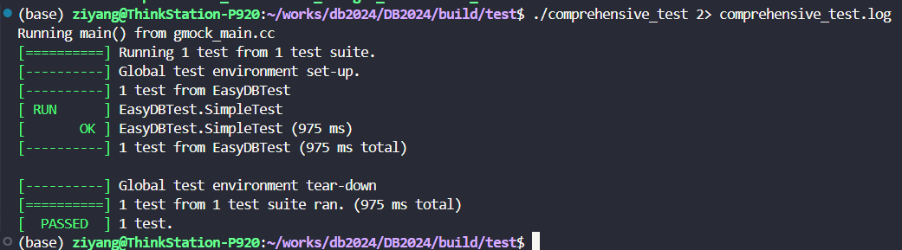
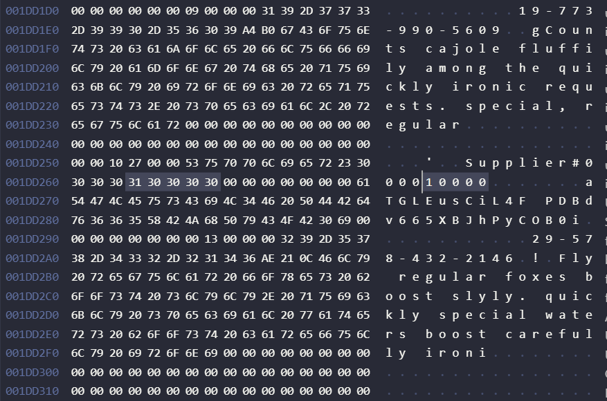

<h1 style="display: flex; justify-content: center">存储管理实验报告</h1>

# 1. 实验分工安排

周强俊：文件组织管理、报告撰写

唐雨馨：缓冲区管理、报告撰写

周智淦：LRU淘汰算法实现、报告撰写

字阳：测试、报告撰写

# 2.系统环境

系统：Ubuntu-24.04

clang版本：18.1.3

glibc版本：2.39

cmake版本：3.28.3

# 3. 实验设计与实现

## 3.1 文件组织管理

### 3.1.1 概述

数据库系统的数据文件组织基于一个页面管理的模型，以便高效管理存储、内存和磁盘之间的数据流动。每一个数据库对应一个同名的文件夹，其中存储着与该数据库相关的所有数据与日志信息。数据文件的组织分为以下几个关键模块：

- **数据库文件**：每个数据库包含两个关键文件：

  - `<database>.meta` 文件：用于存储该数据库的元数据，包括表名称和每张表的元数据结构信息。

  - `<database>.log` 文件：记录数据库的日志信息，用于事务和故障恢复。

- **表文件**：每张表对应一个同名的文件，表文件中存储该表的所有记录。记录被划分为多个数据页（Page），所有的记录顺序地存储在这些数据页中，表文件中的数据页按照固定的 4KB 大小进行分页管理。

### 3.1.2 数据页的结构

数据库系统通过 **Page** 类对数据页进行封装和管理。每一个数据页被分为两个区域：

- **页头（Header）**：存放有关该页的元数据信息，如页面日志序列号（page_lsn_）和页面头信息（page_hdr）。

  - `page_lsn_`：预留用于故障恢复模块，确保在系统发生故障时，能够通过日志恢复丢失的数据。

  - `page_hdr`：包含两个重要信息：

    - `num_records`：记录该数据页中已经存储的记录数量。

    - `next_free_page_no`：标记下一个有可用空间的数据页编号，以便在当前页写满时，能够迅速定位下一个可写入的数据页。

- **数据区（Data Area）**：用于存储表中的实际记录。数据区的大小依据数据页的大小（即 4KB）进行分配。

### 3.1.3 数据页的 I/O 管理

系统通过 **BufferPoolManager** 管理数据页在内存与磁盘之间的读写操作。当数据页需要从磁盘加载到内存，或内存中的数据页需要写回磁盘时，BufferPoolManager 会协调相关操作。

同时，**DiskManager** 负责与磁盘的直接交互，提供数据文件的读写功能。所有的页 I/O 操作都会经过 DiskManager 实现文件的低级读写。

### 3.1.4 记录管理

为了更好地管理表中的记录，系统实现了一个 **记录管理器**，其主要由以下两个类构成：

- **RmFileHandle 类**：负责管理表文件中的记录操作，包含文件描述符和文件头信息，允许对表中的记录进行插入、修改、删除等操作。

- **RmScan 类**：用于遍历表文件中的记录，通过逐页扫描的方式访问数据，适用于查询和分析操作。

对于单个数据页，系统通过 **RmPageHandle 类** 进行进一步的封装和管理，确保每个数据页的页头信息与数据内容的完整性。

### 3.1.5 页面管理策略

数据库系统采用分页机制对内存中的数据进行统一管理。每一个数据页都对应一个唯一的页号（page_id），系统利用页号作为索引，在同一文件中高效定位不同的数据页。数据页的分页设计不仅便于管理大规模的表数据，还能通过元数据来快速确定页面状态，如是否还有空闲空间等，进一步提升数据操作的效率。

## 3.2 缓冲区管理

缓冲区管理通过类``BufferPoolManager``实现。``BufferPoolManager``对内存中的缓冲池进行管理，内存中的缓冲池由若干个帧(frame)组成，缓冲池中每一个帧可以存放一个数据⻚，没有存放数据⻚的帧叫做空闲帧。系统对缓冲池中所有数据⻚的修改都暂时保存在内存中，只有当缓冲池中的数据页被替换时，才会把这些修改的数据刷新到磁盘中。通过实现页面的固定、释放、替换、刷盘等操作，``BufferPoolManager``有效管理了内存与磁盘间的数据交换。

### 3.2.1 设计思路

#### 3.2.1.1 缓冲区组织

缓冲区由三个关键数据结构构成：缓冲池，页表，空闲帧列表 。逻辑上，缓冲池是帧的序列，它存放放入内存中的页面，页表记录磁盘上的数据页面和缓冲池中帧的映射关系，如果数据页存放在某一帧中，则在页表中存放该数据页ID和对应帧号的映射关系，用于标记数据页在缓冲池中的存放位置，空闲帧列表记录缓冲池中未使用的空闲帧的帧号列表。此外，缓冲区需要维护一个替换算法器``std::s。替换算法器中维护缓冲区中各个帧的pin值的情况，并提供缓冲区满时的替换策略支持。它提供缓冲池的页面替换算法。当空闲帧列表为空时，表示所有的帧都被页面占用了，这时如果要把一个新的数据页放入缓冲池中，就必须淘汰一个旧页面，使用替换算法器可以选择一个能被淘汰的页面。

#### 3.2.1.2 缓冲区查找

我们将页表实现为一个哈希表。当需要查找缓冲池中指定的页面对应的帧，直接查找页面，如果查找成功，则表明该页面已经导入缓冲池，如果查找失败，则说明该页面在磁盘上，需要导入缓冲池。

#### 3.2.1.3 缓冲区淘汰

在数据库系统中，缓冲池管理是提高数据访问效率的重要组成部分。LRU（Least Recently Used）替换策略是一种常用的缓存管理技术，旨在最大限度地减少数据缺失的发生。本文将对 `lru_replacer.cpp` 和 `lru_replacer.h` 文件中的 LRU 替换策略的实现进行详细分析。

##### 3.2.1.3.1 构造与析构函数

**LRUReplacer 类**的构造函数接收一个参数 `num_pages`，代表 LRU 替换器可以存储的最大页数。析构函数负责释放所有节点的内存，以避免内存泄漏。

##### 3.2.1.3.2 链表节点结构

**LinkListNode 类**用于表示双向链表中的节点，每个节点包含以下成员：

- `val_`：存储页框 ID。

- `prev_`：指向前一个节点的指针。

- `next_`：指向下一个节点的指针。

这使得节点在链表中的插入和删除操作更加高效。

##### 3.2.1.3.3 LRU算法实现

通过哈希表`data_idx_`和双向链表`ListNode*`通过页框 ID 快速索引对应的链表节点。这使得查找和删除操作变为 O(1) 时间复杂度。

##### 3.2.1.3.4 主要功能实现

**删除节点**

`DeleteNode` 函数负责从链表中删除指定节点 `curr`。根据节点的位置（头、尾或中间），更新相应的指针以维持链表的完整性。该方法会处理节点删除后内存的释放。

**选择要被淘汰的页框**

`Victim` 函数负责选择一个最近最少使用的页框进行替换。如果链表为空，返回 `false`；否则，返回头节点的值并删除该节点。通过使用互斥锁 `data_latch_`，确保在多线程环境下对数据的一致性和安全性。

**Pin与Unpin操作**

- `Pin` 函数通过将页框从LRU列表中删除将指定页框锁定，防止其被替换。如果该页框存在于 LRU 列表中，则删除相应节点。

- `Unpin` 函数则用于将指定页框解锁，允许其被替换。如果页框尚未在列表中，则新建一个节点并将其添加到链表的尾部。

**获取当前大小**

`Size` 函数返回当前存储的页框数量，使用互斥锁以确保安全的读操作。

##### 3.2.1.3.5 线程安全性

为了防止线程访问冲突,整个 `LRUReplacer` 的实现使用了 `std::mutex` 进行线程同步，确保在多线程环境下对节点的操作是安全的。

### 3.2.2 代码实现

#### `BufferPoolManager`成员变量

​   ``BufferPoolManager``中定义了如下成员变量。

- ``num_frames_``：记录了缓冲池中帧的数目

- ``latch_``：用于保护缓冲池内部数据的锁

- ``frames``：缓冲池中的帧

- ``page_table_``：页面和帧的映射表。

- ``free_frames_``：空闲帧列表。

- ``replacer_``：替换算法器。

- ``disk_manager``：磁盘管理器。

```cpp
class BufferPoolManager {
 public:
  BufferPoolManager(size_t num_frames, DiskManager *disk_manager);
  ~BufferPoolManager();
    ...
 private:
  /** @brief The number of frames in the buffer pool. */
  const size_t num_frames_;

  /** @brief The latch protecting the buffer pool's inner data structures. */
  std::mutex latch_;      

  /** @brief The frames that this buffer pool manages. */
  std::vector<Page> frames_;

  /** @brief The page table that keeps track of the mapping between pages and buffer pool frames. */
  std::unordered_map<PageId, frame_id_t, PageIdHash> page_table_;

  /** @brief A list of free frames that do not hold any page's data. */
  std::list<frame_id_t> free_frames_;

  /** @brief The replacer to find unpinned / candidate pages for eviction. */
  std::shared_ptr<LRUReplacer> replacer_;

  /** @brief Disk Manager */
  DiskManager* disk_manager_;
};
```

构造函数用于创建一个 `BufferPoolManager` 实例，并初始化所有相关字段，包括缓冲池大小、页面替换策略、磁盘管理器等。其主要步骤如下：

1. 根据 `num_frames` 参数指定的缓冲池大小创建 `LRUReplacer` 对象。

2. 将所有可用帧 ID 放入空闲帧列表 `free_frames_` 中。

析构函数用于销毁 `BufferPoolManager` 对象，释放缓冲池所占用的内存。

------

#### `Size()`

此函数返回缓冲池管理器管理的帧数量，即缓冲池的大小。

```cpp
auto BufferPoolManager::Size() const -> size_t
```

------

#### `NewPage()`

`NewPage` 函数用于在磁盘上分配一个新页面并将其加载到缓冲池。主要步骤包括：

1. 寻找一个受害帧（victim frame）以便存储新页面。

2. 调用 `DiskManager` 分配页面 ID。

3. 如果选中的帧为脏页，将其写回磁盘。

4. 更新页面表并将新页面的 ID 映射到该帧。

```cpp
auto BufferPoolManager::NewPage(PageId *page_id) -> Page *
```

------

#### `DeletePage()`

`DeletePage` 函数用于从磁盘和内存中删除指定页面。如果页面在缓冲池中且被固定（pin_count 不为 0），则无法删除。否则，函数会从磁盘和缓冲池中移除页面并返回 `true`。

```cpp
auto BufferPoolManager::DeletePage(PageId page_id) -> bool
```

------

#### `FlushPage()`

`FlushPage` 函数用于将指定页面的数据写回磁盘。若页面不在页面表中，则返回 `false`。否则，将页面写入磁盘，并清除脏标记 `is_dirty_`。

```cpp
auto BufferPoolManager::FlushPage(PageId page_id) -> bool
```

------

#### `FlushAllPages()`

该函数将指定文件描述符（fd）对应的所有页面数据从内存写回磁盘。主要用于确保文件中的所有页面在磁盘上处于最新状态。

```cpp
void BufferPoolManager::FlushAllPages(int fd)
```

------

#### `FlushAllDirtyPages()`

此函数将缓冲池中所有脏页的数据写回磁盘，确保内存中的数据与磁盘保持同步。使用锁来确保操作的线程安全性。

```cpp
void BufferPoolManager::FlushAllDirtyPages()
```

------

#### `RecoverPage()`

`RecoverPage` 函数用于从磁盘恢复一个页面。它首先检查页面是否已在缓冲池中，若是，则返回该页面并增加其固定计数；否则，它将分配一个新的受害帧，将页面从磁盘读入帧内，重置脏标记和固定计数，并返回页面。

```cpp
auto BufferPoolManager::RecoverPage(PageId page_id) -> Page *
```

------

#### `FindVictimPage()`

`FindVictimPage` 函数用于从空闲帧列表（优先判断）或替换器中查找一个淘汰帧，用于加载新的页面。如果找到可用帧则返回 `true`，否则返回 `false`。其具体逻辑为：

```cpp
auto BufferPoolManager::FindVictimPage(frame_id_t *frame_id) -> bool
```

------

#### `UpdatePage()`

该函数用于更新一个帧中的页面数据和元数据。若页面为脏页，则先将其写回磁盘；然后重置页面数据和元数据。

```cpp
void BufferPoolManager::UpdatePage(Page *frame, PageId new_page_id, frame_id_t, new_frame_id)
```

------

#### `FetchPage()`

`FetchPage` 函数用于在缓冲池中获取指定页面。若页面已在缓冲池中则增加其固定计数，否则从磁盘加载页面并固定到指定帧中。此函数返回页面指针。

```cpp
auto BufferPoolManager::FetchPage(PageId page_id) -> Page *
```

------

#### `UnpinPage()`

`UnpinPage` 函数用于减少缓冲池中页面的固定计数（`pin_count`）。如果计数已为 0，则返回 `false`。若计数大于 0，执行减一操作，并根据输入参数更新页面的脏标记。

```cpp
auto BufferPoolManager::UnpinPage(PageId page_id, bool is_dirty) -> bool
```

# 4 使用手册

## 4.1 编译

```shell
# 先进入到项目目录
cd /path/to/easydb

# 新建build目录并进入
mkdir build
cd build

# 使用cmake编译项目
cmake ..
make -j
```

## 4.2 运行

```shell
# 进入到build/test/目录下
cd build/test

# 运行comprehensive_test并重定向stderr到文件
./comprehensive_test 2> comprehensive_test.log
```

# 5 测试方案与结果

## 5.1 测试设计与实现

### 5.1.1 解析并读入supplier表格

将supplier文件打开并逐条读入数据。我们把读入的数据根据分隔符‘|’进行分割，分割后的结果会保留下来，为后续的接口调用做准备。

为了实现这一功能，我们设计了FileReader类来实现对表格数据文件的解析。

```cpp
class FileReader {
 protected:
  std::ifstream *infile = nullptr;
  std::string buffer;

 public:
  explicit FileReader(const std::string &file_path);
  ~FileReader();
  // 读入一行
  std::basic_istream<char, std::char_traits<char>> &read_line();
  // 获取读入的字符串
  std::string get_buf();
  // 获取分割后的字符串
  std::vector<std::string> get_splited_buf(std::string split_str = "|");
};
```

### 5.1.2 存储supplier表格到数据库

根据实验文档给的supplier表格的字段定义，调用接口，初始化表格的数据结构。接着，使用上一步得到的数据，调用DiskManager和BufferPoolManager提供的接口将所给数据插入到数据库中。

我们实现了TB_Reader这个类来完成该功能。

```cpp
class TB_Reader {
 protected:
  FileReader *file_reader = nullptr;
  std::vector<ColMeta> columns;
  std::string tab_name;

 public:
  TB_Reader(std::string tab_name, std::string file_path);
  ~TB_Reader() { delete file_reader; }
  // 设置表格的字段（列）
  TB_Reader &set_col(std::string name, ColType type, int len, int offset);
  // 解析并存入数据
  void parse_and_insert(RmFileHandle *fh_);
};
```

我们根据supplier表格的字段定义，定义表格结构。

```cpp
TB_Reader tb_reader(TEST_FILE_NAME_SUPPLIER, "../../tmp/benchmark_data/" + TEST_FILE_NAME_SUPPLIER);
// 构造表元数据
tb_reader.set_col("S_SUPPKEY", TYPE_INT, 4, 0)
    .set_col("S_NAME", TYPE_CHAR, 25, 4)
    .set_col("S_ADDRESS", TYPE_VARCHAR, 40, 29)
    .set_col("S_NATIONKEY", TYPE_INT, 4, 69)
    .set_col("S_PHONE", TYPE_CHAR, 15, 73)
    .set_col("S_ACCTBAL", TYPE_FLOAT, 4, 88)
    .set_col("S_COMMENT", TYPE_VARCHAR, 101, 92);  
```

调用DiskManager创建表格对应的文件

```cpp
disk_manager->CreateFile(filename);
int fd = disk_manager->OpenFile(filename);

// 初始化file header
RmFileHdr file_hdr{};
file_hdr.record_size = record_size;
file_hdr.num_pages = 1;
file_hdr.first_free_page_no = RM_NO_PAGE;

// We have: sizeof(hdr) + (n + 7) / 8 + n * record_size <= PAGE_SIZE
file_hdr.num_records_per_page =
    (BITMAP_WIDTH * (PAGE_SIZE - 1 - (int)sizeof(RmFileHdr)) + 1) / (1 + record_size * BITMAP_WIDTH);
file_hdr.bitmap_size = (file_hdr.num_records_per_page + BITMAP_WIDTH - 1) / BITMAP_WIDTH;

// 将file header写入磁盘文件（名为file name，文件描述符为fd）中的第0页
// head page直接写入磁盘，没有经过缓冲区的NewPage，那么也就不需要FlushPage
disk_manager->WritePage(fd, RM_FILE_HDR_PAGE, (char *)&file_hdr, sizeof(file_hdr));
disk_manager->CloseFile(fd);
```

每读入一行记录，就创建一个对应的record，然后将其插入到数据库中。

```cpp
RmRecord rec(fh_->GetFileHdr().record_size);
for (int i = 0; i < cols_.size(); i++) {
    auto &val = values_[i];
    auto &col = cols_[i];
    val.init_raw(col.len);
    std::memcpy(rec.data + col.offset, val.raw->data, col.len);
}
auto rid = fh_->InsertRecord(rec.data);
```

最后还需要调用BufferPoolManager的FlushAllDirtyPages()，将缓存中所有的脏页写入到磁盘里。

### 5.1.3 查看运行结果

一方面，我们在DiskManager和BufferPoolManager中插入了日志输出的代码，因此运行时可以将日志保存到文件中，查看读入、解析和存储表格到数据过程中DiskManager和BufferPoolManager的行为。另一方面，表格的数据将会被存储到文件test.easydb/test.table中，我们可以打开文件查看插入的数据来验证功能的正确性。

## 5.2 结果展示

测试运行之后，终端中会有如下提示



下面是输出的部分日志，从日志中我们可以清楚地看到整个插入过程中DiskManager和BufferPoolManager的行为，看到slot和page分配的情况等。

```
[TEST] 创建DiskManager
[DiskManager] OpenFile
[DiskManager] WritePage
[DiskManager] CloseFile
[DiskManager] OpenFile
[TEST] 创建BufferPoolManager
[DiskManager] ReadPage
[TEST] 开始解析和插入数据
[BufferPoolManager] NewPage
[BufferPoolManager] FindVictimPage
[DiskManager] WritePage
[BufferPoolManager] UnpinPage
[TEST] insert rid: 1 slot num: 0
[BufferPoolManager] FetchPage
[BufferPoolManager] UnpinPage
[TEST] insert rid: 1 slot num: 1
......
```

下图是test.easydb/test.table文件的内容，表格的数据以二进制的形式保存在文件系统中，从图中可以看到，该二进制文件保存了supplier表格中的所有记录



综上，我们的存储管理模块实现了目标功能。

# 6 实验总结

在本次数据库系统实验中，我们团队成功实现了一个高效且功能完备的数据文件组织与管理模块。通过合理的实验分工，我们确保了每个成员都能在其擅长的领域内发挥最大的潜力。

本次实验我们主要进行了以下工作：

1. **数据文件组织管理设计**：我们设计了一种基于页面管理的数据文件组织模型，通过数据库文件、表文件、数据页的结构化设计，以及高效的I/O管理，实现了数据在存储、内存和磁盘之间的高效流动。

2. **缓冲区管理设计**：通过实现BufferPoolManager和LRU替换策略，我们有效地管理了内存与磁盘间的数据交换，显著提高了数据访问效率。

3. **测试方案设计与结果验证**：我们设计了基本的测试方案，通过解析并读入supplier表格、存储数据到数据库，并查看运行结果，初步验证了数据库系统的功能性和稳定性。

4. **明确的分工合作**：团队成员根据各自的专长进行了明确的分工，确保了项目的高效推进。

5. **提供一致的开发环境**：我们为小组成员提供远程服务器，为实验提供了稳定的开发环境，避免了小组成员实验环境不一致导致的兼容性问题。

当然我们仍旧有很多需要改进的地方：

1. **代码优化**：虽然我们已经实现了基本的功能，但在代码的优化和重构方面还有提升空间。

2. **异常处理**：在实验过程中，我们发现系统在处理异常情况时还有待加强。未来可以增加更多的异常处理机制，确保系统的稳定性和健壮性。

3. **性能测试**：本次实验主要关注了功能实现，对于系统性能的测试和优化还有所欠缺。后续可以通过对比不同配置下的性能表现，进一步优化系统设计。

4. **用户文档和接口设计**：虽然我们实现了基本的功能，但在用户文档和接口设计方面还有改进空间。可以提供更详细的用户指南和更友好的API接口，提高系统的易用性。

通过本次实验，我们不仅更加深入地理解了数据库系统的核心概念和关键技术，还提升了团队合作和项目管理的能力。未来，我们计划探索更多的数据库优化技术，如索引优化、查询优化等，进一步加强代码规范，加大测试力度，以期构建一个高效、稳定和易用的数据库系统。经过本次实验，我们对数据库系统有了更深入的理解，也为未来的学习和研究打下了坚实的基础。
